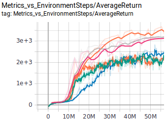

# ALF
Agent Learning Framework (ALF) is a reinforcement learning framework
emphasizing on the easeness of writing complex model architectures. ALF is built
on [Tensorflow 2.0](https://www.tensorflow.org/beta/)

## Features


## Algorithms


* [A2C](alf/algorithms/actor_critic_algorithm.py): [OpenAI Baselines:
ACKTR & A2C](https://openai.com/blog/baselines-acktr-a2c/)
* [DDPG](alf/algorithms/ddpg_algorithm.py): Lillicrap et al. "Continuous control with deep reinforcement learning" [arXiv:1509.02971](https://arxiv.org/abs/1509.02971)
* [PPO](alf/algorithms/ppo_algorithm.py): Schulman et al. "Proximal Policy Optimization Algorithms" [arXiv:1707.06347](https://arxiv.org/abs/1707.06347)
* [SAC](alf/algorithms/sac_algorithm.py): Haarnoja et al. "Soft Actor-Critic Algorithms and Applications" [arXiv:1812.05905](https://arxiv.org/abs/1812.05905)
* [ICM](alf/algorithms/icm_algorithm.py): Pathak et al. "Curiosity-driven Exploration by Self-supervised Prediction" [arXiv:1705.05363](https://arxiv.org/abs/1705.05363)
* [MERLIN](alf/algorithms/merlin_algorithm.py): Wayne et al. "Unsupervised Predictive Memory in a Goal-Directed Agent"[arXiv:1803.10760](https://arxiv.org/abs/1803.10760)

## Installation

You can run the following commands to install ALF
```
git clone https://github.com/HorizonRobotics/alf
cd alf
git submodule update --init --recursive
cd tf_agents
pip install -e .
cd ..
pip install -e .
```

## Examples

### A2C
* [Cart pole](alf/examples/ac_cart_pole.gin).

* [Atari games](alf/examples/ac_breakout.gin). Need to install python package atari-py for atari game environments. 1.5 hours (on one RTX 2080Ti GPU) to reach 800 evaluation (by taking argmax of the policy) score on Breakout.

 

* [Simple navigation with visual input](alf/examples/ac_simple_navigation.gin). Follow the instruction at [SocialRobot](https://github.com/HorizonRobotics/SocialRobot) to install the environment.

### PPO
* [PR2 grasping state only](alf/examples/ppo_pr2.gin). Follow the instruction at [SocialRobot](https://github.com/HorizonRobotics/SocialRobot) to install the environment.
* [Humonoid](alf/examples/ppo_bullet_humanoid.gin). Learning to walk using pybullet humanoid environment. Need to install python pybullet>=2.5.0 for the environment.

 

### ICM
* [Super Mario](alf/examples/icm_super_mario_intrinsic_only.gin). Playing Super Mario only using intrinsic reward.
  Python package gym-retro>=0.7.0 is required for this experiment and also a suitable `SuperMarioBros-Nes` rom should be obtained and imported (roms are not included in gym-retro). See [this doc](https://retro.readthedocs.io/en/latest/getting_started.html#importing-roms) on how to import roms.

 
