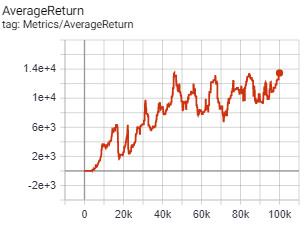
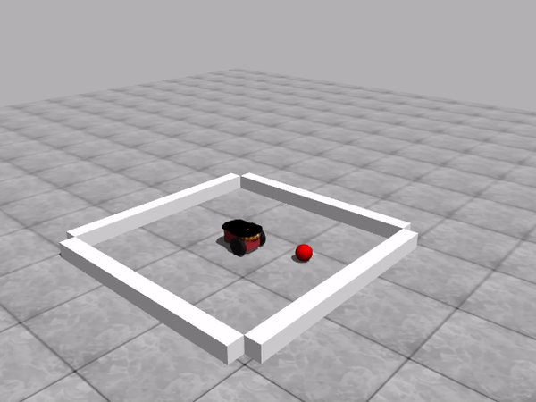
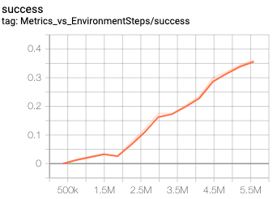
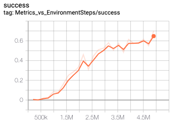
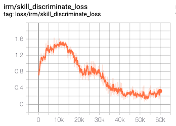
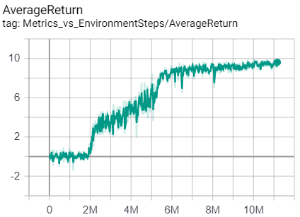

# ALF
<p align="center">
    
</p>


Agent Learning Framework (ALF) is a reinforcement learning framework emphasizing on the flexibility and easiness of implementing complex algorithms involving many different components. ALF is built on [PyTorch](https://pytorch.org/). The development of [previous version](https://github.com/HorizonRobotics/alf/tree/tensorflow) based on [Tensorflow 2.1](https://www.tensorflow.org/) has stopped as of Feb 2020.

## Algorithms

|Algorithm|Type|Reference|
|---------|----|---------|
|[A2C](alf/algorithms/actor_critic_algorithm.py)|On-policy RL|[OpenAI Baselines: ACKTR & A2C](https://openai.com/blog/baselines-acktr-a2c/)|
|[PPO](alf/algorithms/ppo_algorithm.py)|On-policy RL|Schulman et al. "Proximal Policy Optimization Algorithms" [arXiv:1707.06347](https://arxiv.org/abs/1707.06347)|
|[DDPG](alf/algorithms/ddpg_algorithm.py)|Off-policy RL|Lillicrap et al. "Continuous control with deep reinforcement learning" [arXiv:1509.02971](https://arxiv.org/abs/1509.02971)|
|[SAC](alf/algorithms/sac_algorithm.py)|Off-policy RL|Haarnoja et al. "Soft Actor-Critic Algorithms and Applications" [arXiv:1812.05905](https://arxiv.org/abs/1812.05905)|
|[HER](https://github.com/HorizonRobotics/alf/blob/911d9573866df41e9e3adf6cdd94ee03016bf5a8/alf/algorithms/data_transformer.py#L672)|Off-policy RL|Andrychowicz et al. "Hindsight Experience Replay" [arXiv:1707.01495](https://arxiv.org/abs/1707.01495)|
|[TAAC](alf/algorithms/taac_algorithm.py)|Off-policy RL|Yu et al. "TAAC: Temporally Abstract Actor-Critic for Continuous Control" [arXiv:2104.06521](https://arxiv.org/abs/2104.06521)|
|[DIAYN](alf/algorithms/diayn_algorithm.py)|Intrinsic motivation/Exploration|Eysenbach et al. "Diversity is All You Need: Learning Diverse Skills without a Reward Function" [arXiv:1802.06070](https://arxiv.org/abs/1802.06070)|
|[ICM](alf/algorithms/icm_algorithm.py)|Intrinsic motivation/Exploration|Pathak et al. "Curiosity-driven Exploration by Self-supervised Prediction" [arXiv:1705.05363](https://arxiv.org/abs/1705.05363)|
|[RND](alf/algorithms/rnd_algorithm.py)|Intrinsic motivation/Exploration|Burda et al. "Exploration by Random Network Distillation" [arXiv:1810.12894](https://arxiv.org/abs/1810.12894)|
|[MuZero](alf/algorithms/muzero_algorithm.py)|Model-based RL|Schrittwieser et. al. "Mastering Atari, Go, Chess and Shogi by Planning with a Learned Model" [arXiv:1911.08265](https://arxiv.org/abs/1911.08265)|
|[MERLIN](alf/algorithms/merlin_algorithm.py)|Unsupervised learning|Wayne et al. "Unsupervised Predictive Memory in a Goal-Directed Agent"[arXiv:1803.10760](https://arxiv.org/abs/1803.10760)|
|[Amortized SVGD](alf/algorithms/generator.py)|General|Feng et al. "Learning to Draw Samples with Amortized Stein Variational Gradient Descent" [arXiv:1707.06626](https://arxiv.org/abs/1707.06626)|
|[HyperNetwork](alf/algorithms/hypernetwork_algorithm.py)|General|Ratzlaff and Fuxin. "HyperGAN: A Generative Model for Diverse, Performant Neural Networks." [arXiv:1901.11058](https://arxiv.org/abs/1901.11058)|
|[MCTS](alf/algorithms/mcts_algorithm.py)|General|Grill et. al. "Monte-Carlo tree search as regularized policy optimization" [arXiv:2007.12509](https://arxiv.org/abs/2007.12509)|
|[MINE](alf/algorithms/mi_estimator.py)|General|Belghazi et al. "Mutual Information Neural Estimation" [arXiv:1801.04062](https://arxiv.org/abs/1801.04062)|
|[ParticleVI](alf/algorithms/particle_vi_algorithm.py)|General|Liu and Wang. "Stein Variational Gradient Descent: A General Purpose Bayesian Inference Algorithm." [arXiv:1608.04471](https://arxiv.org/abs/1608.04471) <br> Liu et al. "Understanding and accelerating particle-based variational inference." [arXiv:1807.01750](https://arxiv.org/abs/1807.01750)|
|[SVGD optimizer](alf/optimizers/optimizers.py)|General|Liu et al. "Stein Variational Gradient Descent: A General Purpose Bayesian Inference Algorithm." [arXiv:1608.04471](https://arxiv.org/abs/1608.04471)|
|[VAE](alf/algorithms/vae.py)|General|Higgins et al. "beta-VAE: Learning Basic Visual Concepts with a Constrained Variational Framework" [ICLR2017](https://openreview.net/forum?id=Sy2fzU9gl)|

## Installation

Python3.7 is currently supported by ALF. Note that some pip packages (e.g., pybullet) need python dev files, so make sure python3.7-dev is installed:

```
sudo apt install -y python3.7-dev
```

[Virtualenv](https://virtualenv.pypa.io/en/latest/) is recommended for the installation. After creating and activating a virtual env, you can run the following commands to install ALF:

```
git clone https://github.com/HorizonRobotics/alf
cd alf
pip install -e .
```

## Documentation

You can read the [ALF documentation here](https://alf.readthedocs.io/).

## Examples

All the examples below are trained on a single machine Intel(R) Core(TM) i9-7960X CPU @ 2.80GHz with 32 CPUs and one RTX 2080Ti GPU.

You can train any `.gin` file under `alf/examples` using the following command:
```bash
cd alf/examples; python -m alf.bin.train --gin_file=GIN_FILE --root_dir=LOG_DIR
```
* GIN_FILE is the file of [gin configuration](https://github.com/google/gin-config).
You can find sample gin configuration files for different tasks under directory
[alf/examples](alf/examples) (note that some of the examples have not been converted to use
the latest pytorch version of ALF).
* LOG_DIR is the directory when you want to store
the training results. Note that if you want to train from scratch, a new value
for LOG_DIR need to be used. Othewise, it is assumed to resume the
training from a previous checkpoint (if any).

Or alternatively, train any `_conf.py` file under `alf/examples` as follows:
```bash
cd alf/examples; python -m alf.bin.train --conf=CONF_FILE --root_dir=LOG_DIR
```
* CONF_FILE follows ALF configuraion file format (basically python).
Note that we are in the process of converting all `.gin` examples to `_conf.py`
examples, because of the flexibility of ALF configuration.

During training, you can use tensorboard to show the progress of training:
```bash
tensorboard --logdir=LOG_DIR
```

After training, you can visualize the trained model using the following command:
```bash
python -m alf.bin.play --root_dir=LOG_DIR
```

**Troubleshooting**: if an error says that no configuration file is found, then probably you are not under `alf/examples`.

### A2C
* [Cart pole](alf/examples/ac_cart_pole.gin). The training score took only 30 seconds to reach 200, using 8 environments.

   

* [Atari games](alf/examples/ac_breakout.gin). Need to install python package atari-py for atari game environments. The evaluation score (by taking argmax of the policy) took 1.5 hours to reach 800 on Breakout, using 64 environments.

   

* [Simple navigation with visual input](alf/examples/ac_simple_navigation.gin). Follow the instruction at [SocialRobot](https://github.com/HorizonRobotics/SocialRobot) to install the environment.

   

### PPO
* [PR2 grasping state only](alf/examples/ppo_pr2.gin). Follow the instruction at [SocialRobot](https://github.com/HorizonRobotics/SocialRobot) to install the environment.

   


* [Humanoid](alf/examples/ppo_bullet_humanoid.gin). Learning to walk using the pybullet Humanoid environment. Need to install python pybullet>=2.5.0 for the environment. The evaluation score reaches 3k in 50M steps, using 96 parallel environments.

   

### DDPG
* [FetchSlide (sparse rewards)](alf/examples/ddpg_fetchslide.gin). Need to install the [MuJoCo](https://www.roboti.us/index.html) simulator first. This example reproduces the performance of vanilla DDPG reported in the OpenAI's Robotics environment [paper](https://arxiv.org/pdf/1802.09464.pdf). Our implementation doesn't use MPI, but obtains (evaluation) performance on par with the original implementation. (*The original MPI implementation has 19 workers, each worker containing 2 environments for rollout and sampling a minibatch of size 256 from its replay buffer for computing gradients. All the workers' gradients will be summed together for a centralized optimizer step. Our implementation simply samples a minibatch of size 5000 from a common replay buffer per optimizer step.*) The training took about 1 hour with 38 (19*2) parallel environments on a single GPU.

   

### SAC
* [Bipedal Walker](alf/examples/sac_bipedal_walker.gin).

   

* [FetchReach (sparse rewards)](alf/examples/sac_fetchreach.gin). Need to install the [MuJoCo](https://www.roboti.us/index.html) simulator first. The training took about 20 minutes with 20 parallel environments on a single GPU.

   

* [FetchSlide (sparse rewards)](alf/examples/sac_fetchslide.gin). Need to install the [MuJoCo](https://www.roboti.us/index.html) simulator first. This is the same task with the DDPG example above, but with SAC as the learning algorithm.
Also it has only 20 (instead of 38) parallel environments to improve sample efficiency. The training took about 2 hours on a single GPU.

   

* [Fetch Environments (sparse rewards) w/ Action Repeat](alf/examples/sac_actrepeat_fetch/sac_actrepeat_fetch.gin). We are able to achieve even better performance than reported by DDPG + Hindsight Experience Replay in some cases simply by using SAC + Action Repeat with length 3 timesteps. See [this note](docs/notes/fetch_env_sac_actrepeat_notes.rst) to view learning curves, videos, and more details.

### ICM
* [Super Mario](alf/examples/icm_super_mario_intrinsic_only.gin). Playing Super Mario only using intrinsic reward.
  Python package gym-retro>=0.7.0 is required for this experiment and also a suitable `SuperMarioBros-Nes` rom should be obtained and imported (roms are not included in gym-retro). See [this doc](https://retro.readthedocs.io/en/latest/getting_started.html#importing-roms) on how to import roms.

   

### RND
* [Montezuma's Revenge](alf/examples/ppo_rnd_mrevenge.gin). Training the hard exploration game Montezuma's Revenge with intrinsic rewards generated by [RND](alf/algorithms/rnd_algorithm.py). A lucky agent can get an episodic score of 6600 in 160M frames (40M steps with `frame_skip=4`). A normal agent would get an episodic score of 4000~6000 in the same number of frames. The training took about 6.5 hours with 128 parallel environments on a single GPU.


### DIAYN
* [Pendulum](alf/examples/diayn_pendulum.gin). Learning diverse skills without external rewards.

  
  


### Merlin
* [Collect Good Objects](alf/examples/merlin_dmlab_collect_good_objects.gin). Learn to collect good objects and avoid bad objects.
  `DeepmindLab` is required,  Follow the instruction at [DeepmindLab](https://github.com/deepmind/lab/blob/master/python/pip_package/README.md) to install the environment.

   


### MISC
* [Playground with a red ball](alf/examples/misc_playground.gin) and [with two balls, a red ball and a blue ball](alf/examples/misc_playground_two_balls.gin).  The agent learns to interact with the objects via the MI-based internal drive.

   

### MuZero
* [6x6 Go](alf/examples/muzero_go_6x6.gin). It took about a day to train a reasonable agent to play 6x6 go using one GPU.

  


## Contribute to ALF

You can follow the [guideline here](https://alf.readthedocs.io/en/latest/contributing.html).
