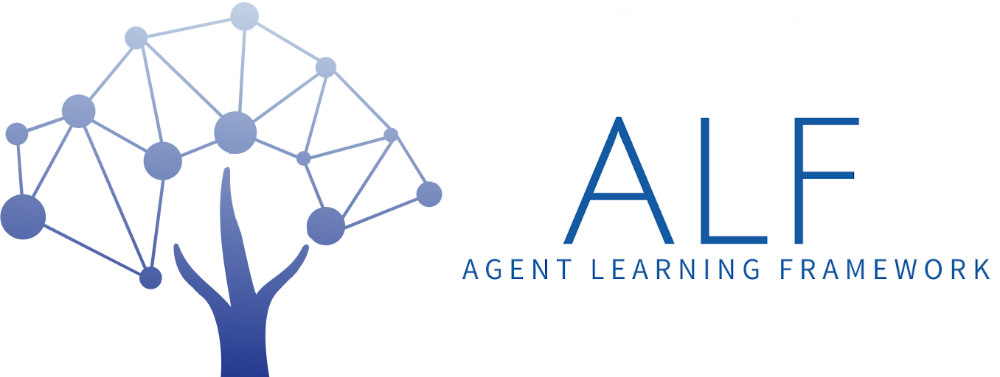

# ALF
<p align="center">
    
</p>

[](https://travis-ci.org/HorizonRobotics/alf)

Agent Learning Framework (ALF) is a reinforcement learning framework emphasizing on the flexibility and easiness of implementing complex algorithms involving many different components. ALF is built on [Tensorflow 2.0](https://www.tensorflow.org/beta/).

## Algorithms

* [A2C](alf/algorithms/actor_critic_algorithm.py): [OpenAI Baselines: ACKTR & A2C](https://openai.com/blog/baselines-acktr-a2c/)
* [DDPG](alf/algorithms/ddpg_algorithm.py): Lillicrap et al. "Continuous control with deep reinforcement learning" [arXiv:1509.02971](https://arxiv.org/abs/1509.02971)
* [PPO](alf/algorithms/ppo_algorithm.py): Schulman et al. "Proximal Policy Optimization Algorithms" [arXiv:1707.06347](https://arxiv.org/abs/1707.06347)
* [SAC](alf/algorithms/sac_algorithm.py): Haarnoja et al. "Soft Actor-Critic Algorithms and Applications" [arXiv:1812.05905](https://arxiv.org/abs/1812.05905)
* [ICM](alf/algorithms/icm_algorithm.py): Pathak et al. "Curiosity-driven Exploration by Self-supervised Prediction" [arXiv:1705.05363](https://arxiv.org/abs/1705.05363)
* [MERLIN](alf/algorithms/merlin_algorithm.py): Wayne et al. "Unsupervised Predictive Memory in a Goal-Directed Agent"[arXiv:1803.10760](https://arxiv.org/abs/1803.10760)
* [Amortized SVGD](alf/algorithms/generator.py): Feng et al "Learning to Draw Samples with Amortized Stein Variational Gradient Descent"[arXiv:1707.06626](https://arxiv.org/abs/1707.06626)
* [RND](alf/algorithms/rnd_algorithm.py): Burda et al "Exploration by Random Network Distillation" [arXiv:1810.12894](https://arxiv.org/abs/1810.12894)
* [MINE](alf/algorithms/mi_estimator.py): Belghazi et al "Mutual Information Neural Estimation" [arXiv:1801.04062](https://arxiv.org/abs/1801.04062)

## Installation

You can run the following commands to install ALF
```
git clone https://github.com/HorizonRobotics/alf
cd alf
git submodule update --init --recursive
cd tf_agents
pip install -e .
cd ..
pip install -e .
```

## Examples

All the examples below are trained on a single machine Intel(R) Core(TM) i9-7960X CPU @ 2.80GHz with 32 CPUs and one RTX 2080Ti GPU.

You can train model of the examples using the following command:
```bash
python -m alf.bin.train --gin_file=GIN_FILE --root_dir=LOG_DIR
```
GIN_FILE is the file of [gin configuration](https://github.com/google/gin-config).
You can find sample gin configuration files for different tasks under directory
[alf/examples](alf/examples). LOG_DIR is the directory when you want to store
the training results.

During training, you can use tensorboard to show the progress of training:
```bash
tensorboard --logdir=LOG_DIR
```

After training, you can visualize the trained model using the following command:
```bash
python -m alf.bin.play --root_dir=LOG_DIR
```

### A2C
* [Cart pole](alf/examples/ac_cart_pole.gin). The training score took only 30 seconds to reach 200, using 8 environments.

   

* [Atari games](alf/examples/ac_breakout.gin). Need to install python package atari-py for atari game environments. The evaluation score (by taking argmax of the policy) took 1.5 hours to reach 800 on Breakout, using 64 environments.

   

* [Simple navigation with visual input](alf/examples/ac_simple_navigation.gin). Follow the instruction at [SocialRobot](https://github.com/HorizonRobotics/SocialRobot) to install the environment.

   

### PPO
* [PR2 grasping state only](alf/examples/ppo_pr2.gin). Follow the instruction at [SocialRobot](https://github.com/HorizonRobotics/SocialRobot) to install the environment.

   


* [Humonoid](alf/examples/async_ppo_bullet_humanoid.gin). Learning to walk using the pybullet Humanoid environment. Need to install python pybullet>=2.5.0 for the environment. The training score took [1 hour 40 minutes](docs/async_training.md) to reach 2k, using asynchronous training with 2 actors (192 environments).

   

### SAC
* [Bipedal Walker](alf/examples/sac_bipedal_walker.gin).

   

### ICM
* [Super Mario](alf/examples/icm_super_mario_intrinsic_only.gin). Playing Super Mario only using intrinsic reward.
  Python package gym-retro>=0.7.0 is required for this experiment and also a suitable `SuperMarioBros-Nes` rom should be obtained and imported (roms are not included in gym-retro). See [this doc](https://retro.readthedocs.io/en/latest/getting_started.html#importing-roms) on how to import roms.

   


### Merlin
* [Collect Good Objects](alf/examples/merlin_dmlab_collect_good_objects.gin). Learn to collect good objects and avoid bad objects.
  `DeepmindLab` is required,  Follow the instruction at [DeepmindLab](https://github.com/deepmind/lab/blob/master/python/pip_package/README.md) to install the environment.

   
