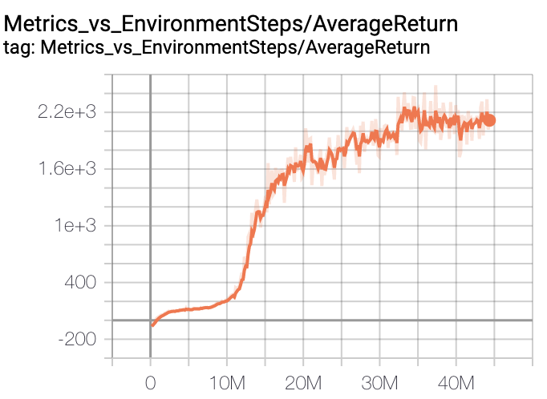
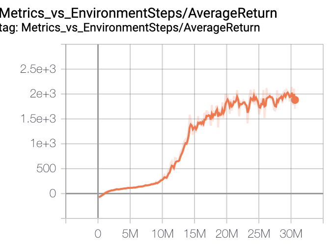
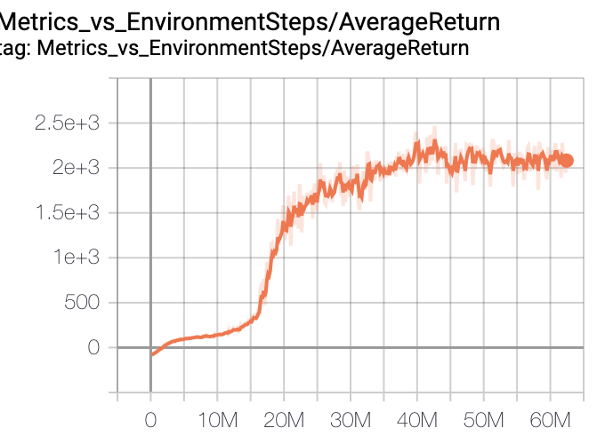

# Asynchronous PPO for PyBullet humanoid
We compare synchronous off-policy training vs asynchronous off-policy training on an example of training humanoid using PPO. In the end we will draw some conclusions on when&how to use asynchronous off-policy training. You can consider them as a general guide of async training.

## Experiments
In the below, the only difference between A2C PPO and Async PPO is the asynchronization between the learner and the actors. All other hyperparameters are the same.

### A2C
6 hours (30M steps) to reach 2k training score

### Async with 1 actor
1.5x throughput
4 hours (30M steps) to reach 2k training score

### Async with 2 actors
2x throughput
3.5 hours (35M steps) to reach 2k training score

We can see that to some extent the convergence speed is linear to the throughput. With more actors, the training sample efficiency seems to drop (as we would expect 3 hours to reach 2K in the third case). This might have something to do with the PPO algorithm which originally assumes that before every update, the behavior policy is the same with the training one, and the values are always fit to the values generated by the behavior policy. More actors will yield a greater policy lag.

## Some training statistics
According to the numbers provided for the A2C PPO humanoid experiment, namely, 50M steps for 10 hours, I computed the following numbers for comparison.

1. A2C PPO takes about 11s between every two training updates, where training takes about 5s and rollout takes about 6s. The training and rollout are always intervened.
2. Async with 1 actor takes about 7.5 seconds between every two training updates, where the training itself takes 5.3s and it waits 2.2s for the learning queue to load data on average.
3. Async with 2 actors takes about 5.6 seconds between every two training updates, and there is basically no wait for the learning queue.

## CPU resources
Since async with 2 actors can basically eliminate the learning queue wait time, there is no benefit rolling out with >2 actors. In fact, my machine has only 32 cpu cores, so even with 2 actors, the simulation time has been increased for every step.

## Conclusion
Whenever possible, we want to minimize the time interval between every two training updates to maximize the throughput (only if the algorithm supports such obtained data).  Generally this can be done by using more actors, however, the CPU resource limit must be taken into account.

**On a single machine, we can imagine that async training is most suitable for problems with simple neural models but complex environment simulations (3D rendering, physics, etc) as seen in the PyBullet envs like Humanoid. Because with simple models, GPU computations (training&inference) can be carried out simultaneously without being slowed down by each other. The system bottleneck is mostly CPU simulation.**
