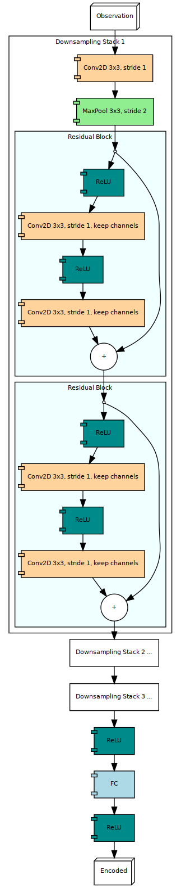

## Example Networks

This subdirectory is meant to hold a collection of customized networks that would be useful for algorithms and experiments defined in [examples](../).

## The Impala CNN Encoder

The name follows the [original Impala paper](https://arxiv.org/pdf/1802.01561.pdf), where a Residual Block based encoding network is employed.

The graph of the Impala CNN Encoder looks like below.

The residual block here is different from the standard bottleneck block in residual network mainly at 
 
1. It applies a `ReLU` when the input goes into the convolutional layers.
2. There are 2 `3x3` convolutional layers that **does not** change the number of channels.
3. There is no `ReLU` after the residual connection.
