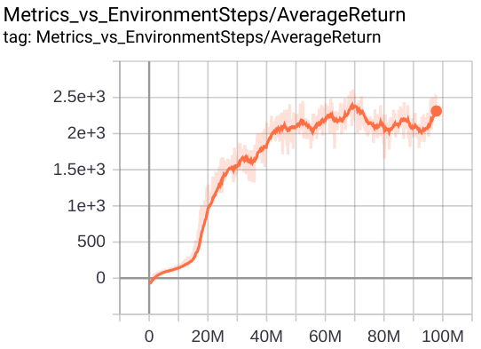

# Asynchronous training guide

We compare synchronous off-policy training *vs.* asynchronous off-policy training on PyBullet [Humanoid](https://github.com/bulletphysics/bullet3/tree/master/examples/pybullet/gym/pybullet_data/humanoid) using [PPO2](https://arxiv.org/abs/1707.06347). Through this example, we want to show how *training* *throughput* can affect the convergence speed in a positive way, and how to effectively increase the throughput (up to 5 times) by adopting the asynchronous setting. We will draw conclusions on possible scenarios that asynchronous training is most suitable for.

By using asynchronous training and optimizing the throughput, I was able to decrease the convergence time to 1h 40mins (from the original 6h) on humanoid.

Disclaimer: You can consider this doc as a general guide of setting up async training, but be aware that ideas in this doc might not apply to any RL problem.

## Background

Let K be the batch size of the tf_agents batched environment. Suppose there are N actors, then there are KN environments in total, with each actor acting on a batched environment of size K. For sync training, N=1. For async training, we will use N=2 in the experiments. We always have a single learner in both cases, and the learner can only learn from trajectories of one actor at a time. All other hyperparameters are the same.

The difference between sync and async training is whether the parameter update and environment rollout can happen simultaneously. The definition of *sync training* is that prediction and learning are intervened like below:

`pred -> learn -> pred -> learn → ...`

On the contrary, *async training* decouples them in the following way:

`pred → pred → pred → ...   (several actors running in parallel)`

`           |`

`(synchronize periodically)`

`           |`

`learn → learn → learn → ... (one learner)`

The learner waits for a batch of trajectories to be collected by an actor, updates parameters, and waits for the next batch (probably from a different actor), and so on.

To recap, PPO uses a batch of trajectories only once (but may update parameters many times on it). So the total number of environment steps is always equal to the total number of training samples. This data pipeline is similar to an on-policy setting, where no experience is replayed.

## Difference with IMPALA

Our pipeline is almost the same with [IMPALA](https://arxiv.org/abs/1802.01561). However, in IMPALA, all the environments are independent: they all run in parallel without being tied together (yet it’s possible that actor numbers < env numbers). In our case, we have a hierarchy: N batched environments, each of size K. This could potentially decrease the communication overhead.

## Throughput EPS

Suppose the average time interval between every two training iterations is T. Given all the other parameters fixed (e.g., rollout length), we define the EPS (environments per seconds) as the training throughput: K/T.  Note that EPS is independent of N, i.e., irrelevant to how many actors we have in this particular problem. Intuitively, EPS tells us how many steps (with a constant multiplier) per second the learner sees. The figure below illustrates three different EPS values in sync and async examples:

In the above, K=32. The EPSs for the three settings are 32/10=3.2, 32/9=3.6, 32/6=5.3, respectively. Even though EPS=K/T doesn’t explicitly depend on N, T might be affected by KN because the rollout time of each actor depends on the computational resource constraints (e.g., CPU/GPU, data bandwidth, etc). As N increases, T might also increase due to resource competition.

In our PPO experiments, EPS can be a highly effective indicator of the convergence speed: we would expect the algorithm to converge faster if EPS is higher.

## Optimize EPS

To verify if a higher EPS leads to a faster convergence, we tried different values of K, and report their corresponding T (in seconds) below:

|K	|sync (T, EPS)	|async (T, EPS)	|EPS ratio: async/sync	|
|---	|---	|---	|---	|
|32	|(10, 3.2)	|(6, 5.3)	|1.6	|
|48	|(13, 3.7)	|(7, 6.9)	|1.9	|
|96	|(20, 4.8)	|(6.5, 14.8)	|3.1	|

We can see that with K=96, the EPS ratio reaches a maximum value of 3.1. And for either async or sync training, a greater K increases the EPS. The EPS of async K=96 is about 5 times that of sync K=32.

## Experiments

In the below, we report the actual training curves for 4 data points in the above table, and see if convergence speed is proportional to EPS. For all runs, we turned off the training summary code.

**sync K=32**

EPS=3.2;  5h 40mins (33M steps) to reach 2k training score

**async K=32**

EPS=5.3;  4h 20mins (40M steps) to reach 2k training score

**sync K=96 (**`alf/examples/ppo_bullet_humanoid.gin`**)**

EPS=4.8;  3h 20mins (29M steps) to reach 2k training score

**async K=96 (**`alf/examples/async_ppo_bullet_humanoid.gin`**)**

EPS=14.8; 1h 40mins (46M steps) to reach 2k training score

## Results analysis

We can see that the convergence speed is roughly proportional to EPS. However, generally async training is less sample efficient than sync training. For example, sync K=96 is roughly 1.5x (46M/29M) sample efficient than async K=96, which results in 1.5x longer training time for async K=96 (otherwise it would be 100mins/1.5=66 mins assuming the same sample efficiency). There might be two reasons for the lower sample efficiency in async training:

1. Due to the lag between the rollout policy and the learning policy, async training always predicts with out-dated policies. So there are at most 100% redundant steps from the perspective of performance logging.
2. PPO assumes that at the beginning of each training iteration, the behavior policy and the training policy are the same. But this is not the case in async training, which may make the algorithm itself less effective.

## Conclusion

If possible, we want to minimize the time interval T between every two training iterations to maximize the throughput EPS (assuming K fixed).  Generally this can be achieved by using more than one actors (N > 1) running asynchronously with the training. However, the T must be verified empirically as more actors might have resource competitions.

On a single machine, we can imagine that async training is most suitable for problems with simple neural models but complex environment simulations (3D rendering, physics, etc) as seen in the PyBullet envs like Humanoid. Because with simple models, the system bottleneck is mostly CPU simulation and the rollout time is much greater than the training time.

Because async training generally is less sample efficient than sync training, it’s recommended to use it for cases where sample efficiency is not the main metric, e.g., to have faster turn-around times for tweaking model hyperparameters.
