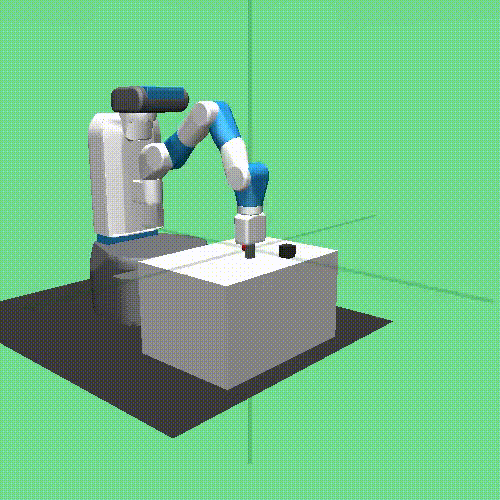

Fetch Environments with SAC + Action Repeat
===========================================

By using regular Soft Actor Critic (SAC) with an Action Repeat length of 3,
we are able to achieve very good performance on the Fetch environments
introduced here: https://openai.com/blog/ingredients-for-robotics-research/

The performance/sample efficiency is better than DDPG+HER (Hindsight
Experience Replay) in some environments as in their report:
https://arxiv.org/pdf/1802.09464.pdf, despite the lack of HER in our
implementation.

We have 38 parallel rollouts and run for 4.75M timesteps in total, just like
in the Fetch report. We performed a search around the ``unroll_length``,
which dictates the frequency at which we train our policy and Q functions. We
found that an unroll length of 8 ``(50 (episode length) // [3 (Action repeat
length) * 2])``, which essentially doubles the number of training steps as in
the report, is the best for both sample efficiency and final performance. All
other parameters were chosen to match those in the report as closely as
possible, although we do not incorporate an action L2 norm penalty or
observation normalization.

**Note that due to the Action Repeat length of 3, the timesteps below should be multiplied by 3 for the real environment steps taken, and the videos have a 3x speedup**

`FetchReach <../../alf/examples/sac_actrepeat_fetch/sac_actrepeat_fetch_reach.gin>`_
------------------------------------------------------------------------------------

`FetchPush <../../alf/examples/sac_actrepeat_fetch/sac_actrepeat_fetch_push.gin>`_
----------------------------------------------------------------------------------

`FetchPickAndPlace <../../alf/examples/sac_actrepeat_fetch/sac_actrepeat_fetch_pick_and_place.gin>`_
----------------------------------------------------------------------------------------------------

`FetchSlide <../../alf/examples/sac_actrepeat_fetch/sac_actrepeat_fetch_slide.gin>`_
------------------------------------------------------------------------------------

