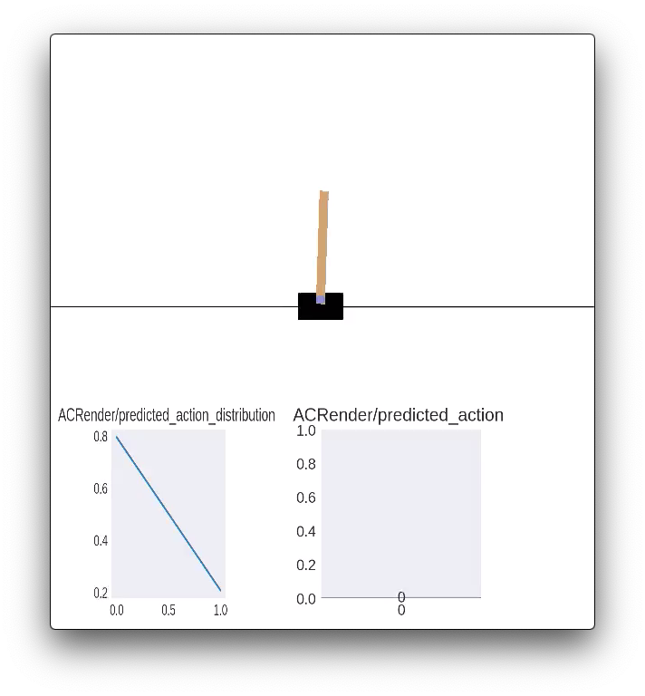

ALF snapshot and advanced play
==============================

Recall that in the first chapter :doc:`./a_minimal_working_example`, we introduced
the concept of *play* as the process of evaluating a trained model on a task while
possibly doing some visualization. There we showed very basic usage of the
:mod:`.alf.bin.play` module by loading a trained model and rendering the environment to
the screen or a video. Now we describe how to utilize ALF's advanced play features
to evaluate or debug a model in depth.

ALF snapshot
------------

ALF calls :func:`.alf.trainers.policy_trainer.play` to play a trained model. But
which code version does ALF use? By default, one expects to use the *current*
up-to-date code to do this. However, there are many circumstances when we don't
want to do so. For example, we'd like to play a model that was trained a long time
ago, in one of the following scenarios:

1. the ALF repo is always a fixed version, but we tried out different ideas
   by constantly changing our own project code (e.g., algorithms) after training
   the model;
2. we wanted to use new features of ALF and pulled the lastest ALF after training
   the model;
3. as ALF developers, we updated the ALF repo constantly and it may be no longer
   compatible with the trained model.

These cases sound like not a big issue if we only use ALF once for all, but it
does become disastrous if ALF is used for many projects repeatedly and the code
version keeps evolving. Of course, version control systems like `Git <https://git-scm.com/>`_
can help to some extent, but the key question is, how do we reliably establish
a one-to-one mapping between a code version and a trained model? Git clearly is
not the most satisfying answer to this.

To solve this issue, ALF uses a simple approach. Whenever lauching a training
(:mod:`.alf.bin.train`) or grid searching (:mod:`.alf.bin.grid_search`) job, ALF
takes a snapshot of the current repo and stores it in the job root dir. For example,
the following command

.. code-block:: bash

    python -m alf.bin.train --root_dir /tmp/alf_tutorial1 --conf <ALF_ROOT>/alf/examples/tutorial/minimal_example_conf.py

will store an ALF snapshot at ``/tmp/alf_tutorial1/alf``. The snapshot directory
has exactly the same structure with the ALF repo (i.e., it is a clone).

.. note::

    ALF relies on `rsync <https://man7.org/linux/man-pages/man1/rsync.1.html>`_
    to copy all ``*.py``, ``*.gin``, and ``*.json`` files under the ALF repo to
    a snapshot. The size of a snapshot is roughly 15M which is acceptable given
    modern disk storage capacity.

In this way, each trained model is accompanied with an ALF snapshot which is exactly
the code version that trained that model. Even if we implement our own algorithms
without touching ALF, our own code will get a snapshot if *it's put under the ALF
repo*.

When playing a trained model with snapshot enabled, we can add an option ``--use_alf_snapshot``
to use the archived ALF version instead of the current one:

.. code-block:: bash

    python -m alf.bin.play --root_dir /tmp/alf_tutorial1 --use_alf_snapshot

You'll notice some message like

.. code-block:: bash

    I0914 11:49:21.344848 140367115069248 play.py:168] === Using an ALF snapshot at '/tmp/alf_tutorial1/alf' ===

which indicates that you're indeed using a snapshot version.

.. note::

    It's possible to turn off the snapshot feature. When training or grid searching,
    appending the option ``--nostore_snapshot`` will do so.

Advanced play by rendering
--------------------------

Besides playing with a snapshot, another advanced play case is to utilize the
:mod:`.alf.summary.render` module. This module contains several helper functions
that convert arrays and tensors to :class:`~.render.Image` objects for visualization
on screen or in a video. Any :class:`~.render.Image` object, once put into
``info`` of an ``AlgStep`` returned by an algorithm's ``predict_step()``, will
be concatenated to the corresponding environment frame by the side. Below we'll
walk through an example to show how to use :mod:`.alf.summary.render`. The complete
code is located at :mod:`.alf.examples.tutorial.ac_render_conf`.

We will again train a model on the "CartPole-v0" task. So first of all, we import
all the configuration from :mod:`.alf.examples.ac_cart_pole_conf`:

.. code-block:: python

    from alf.examples import ac_cart_pole_conf

And import the :mod:`~.alf.summary.render` module

.. code-block:: python

    import alf.summary.render as render

Then to tell the :mod:`~.alf.bin.play` module what to render, we overwrite
``predict_step()`` of the original AC algorithm:

.. code-block:: python

    class ACRenderAlgorithm(ActorCriticAlgorithm):
       def predict_step(self, inputs, state):
           alg_step = super().predict_step(inputs, state)
           action = alg_step.output
           action_dist = alg_step.info.action_distribution
           with alf.summary.scope("ACRender"):
               # Render an action image
               action_img = render.render_action(
                   name="predicted_action",
                   action=action,
                   action_spec=self._action_spec)
               # Render an action distribution image
               action_dist_img = render.render_action_distribution(
                   name="predicted_action_distribution",
                   act_dist=action_dist,
                   action_spec=self._action_spec)
           # Put the two ``Image`` objects into ``info``. Any nest structure is
           # acceptable for the new ``info``. ALF's play will look for ``Image``
           # objects.
           return alg_step._replace(
               info=dict(action_img=action_img,
                         action_dist_img=action_dist_img,
                         ac=alg_step.info))

Basically, what we'd like to do is taking the predicted action and action distribution
from the ``AlgStep`` of ``ActorCriticAlgorithm``, and call :func:`.render.render_action`
and :func:`.render.render_action_distribution` to obtain two :class:`~.render.Image`
objects. The final step is to make sure to put the objects in the ``info`` field of
the returned ``AlgStep``. It doesn't matter how we organize the two objects in ``info``:
as long as they are in it, :mod:`~.alf.bin.play` will find and display them.

Note that we created a namescope of "ACRender" when calling the rendering functions.
This namescope usage is exactly the same with the namescope for summary functions:
it will prefix all rendered image names with "ACRender/". These image names will
be displayed as labels in the final video.

Finally, we tell ALF to use our newly defined algorithm:

.. code-block:: python

    alf.config(
        'TrainerConfig',
        algorithm_ctor=partial(
            ACRenderAlgorithm, optimizer=alf.optimizers.Adam(lr=1e-3)))

Now let's train and play this conf file:

.. code-block:: bash

    python -m alf.bin.train --root_dir /tmp/ac_render --conf <ALF_ROOT>/alf/examples/tutorial/ac_render_conf.py
    python -m alf.bin.play --root_dir /tmp/ac_render --num_episodes 1 --record_file /tmp/tmp.mp4 --alg_render

Note that when playing, we need to add the flag ``--alg_render`` to turn on the
:mod:`~.alf.summary.render` module; otherwise the rendering functions will *not*
be called. If we open "tmp.mp4", the video frame will look like:

Basically, along with every environment frame, the action taken at that frame will
also be displayed.

:mod:`~.alf.summary.render` contains other rendering functions (e.g., heatmap,
curve, etc), and we suggest the reader to take a look at its API doc. Some example
rendered frames are:

.. note::

    Currently with ``--alg_render`` the rendering speed will be slow (less than
    one frame per second, depending on how many plots each frame has). This
    inefficiency is largely due to `Matplotlib <https://matplotlib.org/>`_.

Summary
-------

In this chapter we explained what ALF snapshot is, why we need it, and how to use
it for playing a model. We also talked about how to customize rendering during play
to visualize various prediction statistics. These two advanced play use cases
enable us to better evaluate and analyze trained models.