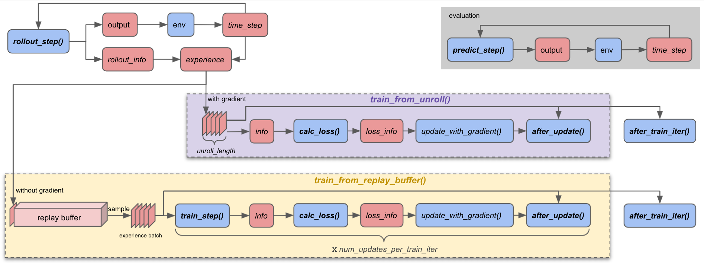

Algorithm interfaces
====================

In the previous chapter, we went over the :ref:`big picture of ALF <chap2_big_picture>`.
Now we will take a look at how different algorithm interfaces interact with each
other in the on-policy/off-policy pipelines. We will try modifying some
algorithm interfaces of the previous example :doc:`./a_minimal_working_example`,
for an illustration purpose. Then we introduce a simple off-policy training
example and again explore its algorithm interfaces.

Overview
--------

The figure above shows the details of on/off-policy training pipelines, along with
a simple evaluation pipeline. To establish a link between this figure and
the figure in the :ref:`big picture of ALF <chap2_big_picture>`, we note that in
the figure above :meth:`~.AlgorithmInterface.train_from_unroll` and
:meth:`~.AlgorithmInterface.train_from_replay_buffer` corresponds to the "update"
stage there for on-policy and off-policy training respectively. The top-left
loop containing :meth:`~.AlgorithmInterface.rollout_step` corresponds to the "unroll"
stage there.

There are several key interfaces (**bold** in the figure above) that play
important roles in assembling a training pipeline of an ALF algorithm, and their
signatures are summarized below.

.. _algo_interfaces_table:

======================================================  =============================================  =======================================  =============================== ===============
Interface                                               Input and output tensor shapes                 Input                                    Output                          Which pipeline?
======================================================  =============================================  =======================================  =============================== ===============
:meth:`~.AlgorithmInterface.predict_step`               :math:`[1,\ldots]`                             ``inputs``, ``state``                    :class:`.AlgStep`               On/Off-policy
:meth:`~.AlgorithmInterface.rollout_step`               :math:`[B_1,\ldots]`                           ``inputs``, ``state``                    :class:`.AlgStep`               On/Off-policy
:meth:`~.AlgorithmInterface.train_step`                 :math:`[B_2,\ldots]` or :math:`[TB_2,\ldots]`  ``inputs``, ``state``, ``rollout_info``  :class:`.AlgStep`               Off-policy
:meth:`~.AlgorithmInterface.calc_loss`                  :math:`[T,B_3,\ldots]`                         ``info``                                 :class:`.LossInfo`              On/Off-policy
:meth:`~.AlgorithmInterface.after_update`               :math:`[T,B_3,\ldots]`                         ``root_inputs``, ``info``                ``None``                        On/Off-policy
:meth:`~.AlgorithmInterface.after_train_iter`           :math:`[T,B_3,\ldots]`                         ``root_inputs``, ``rollout_info``        ``None``                        On/Off-policy
======================================================  =============================================  =======================================  =============================== ===============

.. _interfaces_tasks:

What the interfaces do
----------------------

Most of the time, all we have to do is overriding these interfaces while adhering
to their input/output signatures. These interfaces are expected to fulfill the
following tasks:

- :meth:`~.AlgorithmInterface.predict_step`: This interface is for evaluation
  purpose only. It outputs prediction output such as action, label, goal, etc.
  The output is directly used for evaluating the algorithm's performance. It's
  called in an isolated evaluation pipeline which is activated periodically in
  parallel with training.
- :meth:`~.AlgorithmInterface.rollout_step`: This interface is for data collection.
  It is called during the agent's rollout phase. The outputs will be used to
  interact with the environment, or be stored in a replay buffer for later training
  (if off-policy training). The outputs can also be directly used for training for
  on-policy training.
- :meth:`~.AlgorithmInterface.train_step`: off-policy training only. It's responsible
  to do forward and backward on sampled experiences and generate training info
  for loss computation.
- :meth:`~.AlgorithmInterface.calc_loss`: This interface obtains training info
  from either :meth:`~.AlgorithmInterface.rollout_step` (on-policy training)
  or :meth:`~.AlgorithmInterface.train_step` (off-policy training) and return a
  calculated loss for gradient computation.
- :meth:`~.AlgorithmInterface.after_update`: This function does things after
  completing one gradient update (i.e. through :meth:`~.Algorithm.update_with_gradient`).
  This function can be used for post-processings following one mini-batch update,
  such as copying a training model to a target model in SAC, DQN, etc.
- :meth:`~.AlgorithmInterface.after_train_iter`: It's mainly for training
  additional modules that have their own training logic (e.g., on/off-policy,
  replay buffers, etc). Other things might also be possible as long as they
  should be done once every training iteration.

Argument conventions
--------------------

In ALF, every input/output argument is assumed to be a :mod:`~.alf.nest.nest`.
A nest is defined to be a nested Python container (list, tuple, dict) which is
basically a tree with leaves as data. For example, the following are all nests.

.. code-block:: python

    [1, 2, 3, 4]

    ('x', torch.zeros([2]))

    dict(x=1, y=dict(a=1, b=[2, 3, 4]))

    #from alf.data_structures import namedtuple
    #MyNest = namedtuple('MyNest', ['a', 'b'])

    MyNest(a=1, b=(1, 2))

.. note::

    A special case of a nest is a single leaf, for example, 3, "3",
    ``np.zeros([2, 3])``, or ``torch.zeros([2, 3])``.

* ``inputs`` denotes the observations/states based on which
  an algorithm's interface does computation at every step. Usually,
  :meth:`~.AlgorithmInterface.predict_step`, :meth:`~.AlgorithmInterface.rollout_step`,
  and :meth:`~.AlgorithmInterface.train_step` all have :class:`.TimeStep` as the
  type of ``inputs`` for an RL algorithm. But ``inputs`` can be an
  arbitrary nest for other (e.g., SL, SSL) algorithms.

* :meth:`~.AlgorithmInterface.predict_step`,
  :meth:`~.AlgorithmInterface.rollout_step`, and :meth:`~.AlgorithmInterface.train_step`
  all return a nest called :class:`.AlgStep`, which contains three (optional) fields:

  .. code-block:: python

    AlgStep = namedtuple('AlgStep', ['output', 'state', 'info'], default_value=())

  Each field itself is a nest.

    * ``output`` is specially used to represent a step function's main output, e.g.,
      action of an RL algorithm, latent embedding of an encoder algorithm, or goal
      representation of a goal proposal algorithm.

    * ``state`` denotes working memory (e.g., RNN state) that is automatically reset
      at the beginning of an episode. Any interface with ``state`` as its input must
      return an updated ``state`` so that ALF will automatically feed the updated
      one to the next calling of the same interface at the next time step.

    * ``info`` contains anything other than the interface's output and state, for
      example, tensors for summary, action distributions for training, etc. Depending
      on the context, it might have two alias names: ``train_info`` and ``rollout_info``.
      ``train_info`` usually appears in the context where ``info`` is used for computing losses
      and gradients. ``train_info`` is output by either an on-policy algorithm's
      :meth:`~.AlgorithmInterface.rollout_step` or an off-policy algorithm's
      :meth:`~.AlgorithmInterface.train_step`. ``rollout_info`` exists in the
      context of off-policy training, where the ``info`` of :meth:`~.AlgorithmInterface.rollout_step`
      is used for reference (e.g., it contains rollout action distributions for computing the
      probability ratio in PPO). ``info`` will be passed down to :meth:`~.AlgorithmInterface.calc_loss`,
      :meth:`~.AlgorithmInterface.after_update`, and :meth:`~.AlgorithmInterface.after_train_iter`
      on the pipeline.

* :meth:`~.AlgorithmInterface.calc_loss` returns a :class:`.LossInfo` instance
  that can be correctly processed by :meth:`~.Algorithm.update_with_gradient`,
  in which the losses in :class:`.LossInfo` are combined and gradients are
  computed for an optimizer step.

Tensor shapes
-------------

It's useful to always remind yourself of that ALF's interfaces process **batched**
tensors, which means most of the time you can think of the same computations happen
independently and identically to each entry of sub-tensor along the batch dimension.
(There are of course exceptions to this mental model, for example, `BatchNorm <https://en.wikipedia.org/wiki/Batch_normalization>`_.)

In the table, :math:`T` denotes the temporal extent (time window length) these
interfaces are called during one training iteration. Note :math:`T` is
:attr:`.TrainerConfig.unroll_length` for on-policy algorithms but
:attr:`.TrainerConfig.mini_batch_length` for off-policy algorithms (because a trajectory
of a certain length is sampled from the replay buffer, and this length could be
different from :attr:`.TrainerConfig.unroll_length`). Accordingly, we can see
that the first three interfaces (``predict_step()``, ``rollout_step()``,
``train_step()``) are called on a *per-step* basis (
:math:`t,t+1,\ldots,t+T-1` one by one), while the last three are called once over
*multiple* time steps (:math:`[t,t+T-1]` at one time). :math:`B_1` is
always :attr:`.create_environment.num_parallel_environments`.
:math:`B_2` is :attr:`.TrainerConfig.mini_batch_size` for off-policy algorithms.
:math:`B_3=B_1` for on-policy algorithms and :math:`B_3=B_2` for off-policy
algorithms. The tensor batch size of :meth:`~.AlgorithmInterface.predict_step` is
always :math:`1` because we use only one environment for evaluation.

.. note::

    If :attr:`.TrainerConfig.temporally_independent_train_step=True`, we will call
    :meth:`~.AlgorithmInterface.train_step` on steps along a temporal extent in
    parallel. So the tensor shape is :math:`[TB_2,\ldots]`. This speeds up the
    training forward step and the result will be reshaped to
    :math:`[T,B_2,\ldots]` when fed to :meth:`~.AlgorithmInterface.calc_loss`.

It might be a little difficult to digest all these pieces of information at one time
for a new user. Don't worry! In the following we will revisit them one by one with
examples.

On-policy interfaces example
----------------------------

We modify the minimal working example by introducing a new actor-critic algorithm
that wraps :class:`ActorCriticAlgorithm` and does an additional trivial job of
inspecting tensor shapes. The idea is that in order to understand how the
interfaces interact with each other and what their input/output shapes are like,
we create a new zero tensor of the same shape with inputs/outputs in :meth:`~.AlgorithmInterface.rollout_step`,
and then pass that zero tensor down to other interfaces (:meth:`~.AlgorithmInterface.calc_loss`,
:meth:`~.AlgorithmInterface.after_update`, :meth:`~.AlgorithmInterface.after_train_iter`)
via :attr:`~.AlgStep.info`. We create new tensors instead of directly inspecting
existing inputs/outputs to additionally show how a user can do customized things
and propagate the results.

To pass around the newly created zero tensor in different places, we define
a new data structure

.. code-block:: python

    MyACInfo = namedtuple("MyACInfo", ["ac", "zeros"])

with the field ``ac`` storing the parent :class:`.ActorCriticAlgorithm`'s info and
``zeros`` storing a zero tensor that we're going to create during rollout. Then
we derive from :class:`.ActorCriticAlgorithm` for our new algorithm class and override
its :meth:`~.ActorCriticAlgorithm.rollout_step`:

.. code-block:: python

  class MyACAlgorithm(ActorCriticAlgorithm):
    def rollout_step(self, inputs, state):
        alg_step = super().rollout_step(inputs, state)
        action = alg_step.output
        zeros = torch.zeros_like(action)
        print("rollout_step: ", zeros.shape)
        alg_step = alg_step._replace(
            info=MyACInfo(ac=alg_step.info, zeros=zeros))
        return alg_step

.. note::

  Because the I/O signatures of an interface are fixed, we can't assuming
  receiving or returning an arbitrary list of arguments. For example, simply
  returning the zero tensor along ``alg_step`` will break the pipeline. So we
  need pack it into our own ``info`` structure.

In the new rollout step, we first call the parent's ``rollout_step()``, obtain
its output :class:`.AlgStep` (let the parent finish what it's supposed to do),
and create a zero tensor with the same shape. After printing out the tensor
shape, we put it in the field ``info.zeros``.

According to the diagram above, multiple (:attr:`.TrainerConfig.unroll_length`)
instances of ``alg_step`` will be accumulated and input to :meth:`~.AlgorithmInterface.calc_loss`.
To verify this, we define our own ``calc_loss`` function:

.. code-block:: python

  def calc_loss(self, info: MyACInfo):
    zeros = info.zeros
    print("calc_loss: ", zeros.shape)
    return super().calc_loss(info.ac)

Note that here the input ``info`` is already assumed to be over a temporal extent.
So we obtain the created and stacked zero tensor and print its shape again. We
continue doing the same thing for the other two interfaces:

.. code-block:: python

  def after_update(self, root_inputs, info: MyACInfo):
    zeros = info.zeros
    print("after_update: ", zeros.shape)
    super().after_update(root_inputs, info.ac)

  def after_train_iter(self, root_inputs, rollout_info: MyACInfo):
    zeros = rollout_info.zeros
    print("after_train_iter: ", zeros.shape)
    super().after_train_iter(root_inputs, rollout_info.ac)

The complete example file is at :mod:`.alf.examples.tutorial.on_policy_interfaces_conf.py`.
Now if we launch the training

.. code-block:: bash

    cd <ALF_ROOT>/alf/examples/tutorial
    python -m alf.bin.train --root_dir /tmp/alf_tutorial3 --conf on_policy_interfaces_conf.py

The output will be

::

  rollout_step:  torch.Size([30])
  rollout_step:  torch.Size([30])
  rollout_step:  torch.Size([30])
  rollout_step:  torch.Size([30])
  rollout_step:  torch.Size([30])
  rollout_step:  torch.Size([30])
  rollout_step:  torch.Size([30])
  rollout_step:  torch.Size([30])
  calc_loss:  torch.Size([8, 30])
  after_update:  torch.Size([8, 30])
  after_train_iter:  torch.Size([8, 30])

Recall that for this example, we have ``TrainerConfig.unroll_length=8`` and
``create_environment.num_parallel_environments=30``. Thus the tensor shapes match our
expectation.

Off-policy interfaces example
-----------------------------

As another example, we override :class:`~.sac_algorithm.SacAlgorithm` for the same
experimentation. First we set up some basic training configurations:

.. code-block:: python

    alf.config('create_environment', num_parallel_environments=10)
    alf.config('TrainerConfig',
       temporally_independent_train_step=False,
       mini_batch_length=2,
       unroll_length=3,
       mini_batch_size=4,
       num_updates_per_train_iter=1,
       num_iterations=1)

And define a new class ``MySacAlgorithm`` with a new ``train_step()``

.. code-block:: python

    MySacInfo = namedtuple("MySacInfo", ["sac", "zeros"])

    class MySacAlgorithm(SacAlgorithm):
        def train_step(self, inputs, state, rollout_info: MySacInfo):
            alg_step = super().train_step(
                inputs, state, rollout_info.sac)
            print("train_step rollout zeros:  ", rollout_info.zeros.shape)
            train_zeros = torch.zeros_like(alg_step.output, dtype=torch.uint8)
            print("train_step train ones:" , train_zeros.shape)
            alg_step = alg_step._replace(
                info=MySacInfo(sac=alg_step.info, zeros=train_zeros))
            return alg_step

Here we first print the zero tensor shape in the rollout ``info`` generated by
``rollout_step()``, and then create a new zero tensor of the same shape with the
action output at the current training step. Finally we put this new zero tensor
in the output ``info`` (and discard the ``rollout_info``).

The remaining interfaces are defined similarly with ``MyACAlgorihtm`` above.

.. code-block:: python

    def rollout_step(self, inputs, state):
        alg_step = super().rollout_step(inputs, state)
        action = alg_step.output
        zeros = torch.zeros_like(action)
        print("rollout_step: ", zeros.shape)
        alg_step = alg_step._replace(
            info=MySacInfo(sac=alg_step.info, zeros=zeros))
        return alg_step

    def calc_loss(self, info: MySacInfo):
        zeros = info.zeros
        print("calc_loss: ", zeros.shape, zeros.dtype)
        return super().calc_loss(info.sac)

    def after_update(self, root_inputs, info: MySacInfo):
        zeros = info.zeros
        print("after_update: ", zeros.shape, zeros.dtype)
        super().after_update(root_inputs, info.sac)

    def after_train_iter(self, root_inputs, rollout_info: MySacInfo):
        zeros = rollout_info.zeros
        print("after_train_iter: ", zeros.shape, zeros.dtype)
        super().after_train_iter(root_inputs, rollout_info.sac)

The complete example file is at :mod:`.alf.examples.tutorial.off_policy_interfaces_conf.py`.
Launch the training the we should see the output

::

    rollout_step:  torch.Size([10])
    rollout_step:  torch.Size([10])
    rollout_step:  torch.Size([10])
    train_step rollout zeros:   torch.Size([4])
    train_step train ones: torch.Size([4])
    train_step rollout zeros:   torch.Size([4])
    train_step train ones: torch.Size([4])
    calc_loss:  torch.Size([2, 4]) torch.uint8
    after_update:  torch.Size([2, 4]) torch.uint8
    after_train_iter:  torch.Size([3, 10]) torch.int64

Because we have ``TrainerConfig.unroll_length=3`` and ``create_environment.num_parallel_environments=10``,
during rollout we see 3 calls of ``rollout_step()`` and each creates a zero
tensor of shape :math:`[10]`. Because we are doing off-policy training, these
rollout results are stored in a replay buffer properly.

In ``train_step``, we no longer see the rollout zero tensor shape as :math:`[10]`
since we sample a mini-batch of ``TrainerConfig.mini_batch_size=4`` and ``TrainerConfig.mini_batch_length=2``.
The mini-batch length represents the length of a sampled contiguous trajectory, so
when ``TrainerConfig.temporally_independent_train_step=False``, the training step
is called in chronological order for twice, each with a tensor shape of :math:`[4]`.
And finally ``calc_loss()`` an ``after_update()`` see the accumulated zero tensor.

For off-policy training, an important distinction between ``rollout_info`` and
``train_info`` exists. In the example, we create zero tensors of ``torch.uint8``
in ``train_step()``, while the zero tensors in ``rollout_step()`` are by default
``torch.int64``. From the printing results, we can see that ``calc_loss()`` and
``after_update()`` indeed use ``train_info``.

Note that by design ``after_train_iter()`` accepts ``rollout_info``. This is useful
when there are other child algorithms that have a different training logic with
the parent algorithm, for example, on-policy training on a child algorithm after
an off-policy training iteration of the parent algorithm.

Now if we set ``temporally_independent_train_step=True`` and launch the training,
the training step outputs something different:

::

  rollout_step:  torch.Size([10])
  rollout_step:  torch.Size([10])
  rollout_step:  torch.Size([10])
  train_step rollout zeros:   torch.Size([8])
  train_step train ones: torch.Size([8])
  calc_loss:  torch.Size([2, 4]) torch.uint8
  after_update:  torch.Size([2, 4]) torch.uint8
  after_train_iter:  torch.Size([3, 10]) torch.int64

Notice that this time ``train_step()`` is only called once and the batch size has
become :math:`2\times 4=8`. The previous two calls are folded into just one.
This is because we have chosen to ignore the temporal
dependency in the sampled trajectory so the forward can be done once to speed up
inference.

State example
-------------

Let's move on to another simple example showing how working memory can be conveniently
maintained in :meth:`~.AlgorithmInterface.rollout_step` and
:meth:`~.AlgorithmInterface.train_step`. We first define the training setting:

.. code-block:: python

    alf.config('create_environment', num_parallel_environments=10)

    alf.config('TrainerConfig',
               algorithm_ctor=MyOffPolicyAlgorithm,
               whole_replay_buffer_training=False,
               use_rollout_state=False,
               mini_batch_length=2,
               unroll_length=3,
               mini_batch_size=4,
               num_updates_per_train_iter=1,
               num_iterations=1)

There is a new option :attr:`~.TrainerConfig.use_rollout_state` that indicates
when sampling a trajectory from the replay buffer, *whether we want to use the
rollout state of the first step of the trajectory as the initial state for training*.
If this option is ``False``, then the training initializes all states as zeros.

.. note::

    In order to use rollout states during training, the training state spec must
    be a *subset* of the rollout state spec; otherwise the training states can't be
    properly initialized.

Next we define our dummy off-policy algorithm which doesn't contain any parameter
to be optimized:

.. code-block:: python

  class MyOffPolicyAlgorithm(OffPolicyAlgorithm):
    def __init__(self, observation_spec, action_spec, reward_spec=None,
                 env=None, config=None, debug_summaries=False):
        rollout_state_spec = TensorSpec(shape=(), dtype=torch.int32)
        train_state_spec = TensorSpec(shape=(2,))
        super().__init__(
            env=env,
            config=config,
            debug_summaries=debug_summaries,
            observation_spec=observation_spec,
            action_spec=action_spec,
            train_state_spec=train_state_spec,
            rollout_state_spec=rollout_state_spec)

    def rollout_step(self, inputs, state):
        print("rollout_step: ", state)
        return AlgStep(output=inputs.prev_action, state=state - 1)

    def train_step(self, inputs, state, rollout_info):
        print("train_step: ", state)
        return AlgStep(output=inputs.prev_action, state=state + 1)

    def calc_loss(self, info):
        return LossInfo()

In the constructor, we declare the tensor specs for rollout and training states.
Once done, ALF will automatically reset rollout/training states to zeros before a
new episode starts. In ``rollout_step()``, we simply update the state tensor by
:math:`-1` and in ``train_step()`` we update the state tensor by :math:`+1`. The
complete example conf is at :mod:`alf.examples.tutorial.off_policy_states_conf`.
The output of this conf file is

::

  rollout_step:  tensor([0, 0, 0, 0, 0, 0, 0, 0, 0, 0], dtype=torch.int32)
  rollout_step:  tensor([-1, -1, -1, -1, -1, -1, -1, -1, -1, -1], dtype=torch.int32)
  rollout_step:  tensor([-2, -2, -2, -2, -2, -2, -2, -2, -2, -2], dtype=torch.int32)
  train_step:  tensor([[0., 0.],
          [0., 0.],
          [0., 0.],
          [0., 0.]])
  train_step:  tensor([[1., 1.],
          [1., 1.],
          [1., 1.],
          [1., 1.]])

We can see that during the 3 steps of rollout, the state tensors decrease
from 0 to -2, and during the 2 steps of training, the state tensors
increase from ``[0.,0.]`` to ``[1.,1.]``. So in this case, rollout states and
training states are independent to each other.

Next we modify the training state spec to be the same with the rollout state spec:

.. code-block:: python

    def __init__(self, observation_spec, action_spec, reward_spec=None,
                 env=None, config=None, debug_summaries=False):
        rollout_state_spec = TensorSpec(shape=(), dtype=torch.int32)
        super().__init__(
            env=env,
            config=config,
            debug_summaries=debug_summaries,
            observation_spec=observation_spec,
            action_spec=action_spec,
            train_state_spec=rollout_state_spec,
            rollout_state_spec=rollout_state_spec)

and configure

.. code-block:: python

    alf.config('TrainerConfig', use_rollout_state=True)

The conf file will give us something like

::

    rollout_step:  tensor([0, 0, 0, 0, 0, 0, 0, 0, 0, 0], dtype=torch.int32)
    rollout_step:  tensor([-1, -1, -1, -1, -1, -1, -1, -1, -1, -1], dtype=torch.int32)
    rollout_step:  tensor([-2, -2, -2, -2, -2, -2, -2, -2, -2, -2], dtype=torch.int32)
    train_step:  tensor([-1,  0, -1, -1], dtype=torch.int32)
    train_step:  tensor([0, 1, 0, 0], dtype=torch.int32)

Notice how the training states behave differently this time: they no longer start
from zeros! Because the training mini-batches are randomly sampled from the replay
buffer, the training states can start from any of :math:`\{0,-1,-2\}`.

.. note::

    If the state is defined to be a model memory, e.g., RNN state, then ``use_rollout_state``
    should be carefully set. On one hand, directly using historical rollout RNN states
    will be problematic because the model parameters have been different by the
    time of training. On the other hand, always starting from zero RNN states might
    miss some historical information. In practice, both options have been used by
    prior works.

Finally, if we increase the training iterations and let some episodes finish during
training

.. code-block:: python

    alf.config("TrainerConfig", num_iterations=50)

    def rollout_step(self, inputs, state):
        print("rollout_step: ", state)
        is_first_steps = inputs.is_first()
        is_zero_state = (state == 0)
        assert torch.all(is_zero_state[is_first_steps])
        return AlgStep(output=inputs.prev_action, state=state - 1)

You will find that when a new episode begins (``inputs.is_first()==True``),
then the state will be automatically reset to zero. So in ALF the user doesn't
need to worry about when to re-initialize working memory.

Summary
-------

In this chapter we've explained several major algorithm interfaces of ALF. These
interfaces should be a good starting point for a new user to understand the internal
logic of ALF's pipeline and write his/her own simple algorithms. We also talked
about how on-policy and off-policy algorithms differ regarding the roles of
:meth:`~.AlgorithmInterface.rollout_step` and :meth:`~.AlgorithmInterface.train_step`,
and how to correctly manipulate working memory (state) in ALF.
