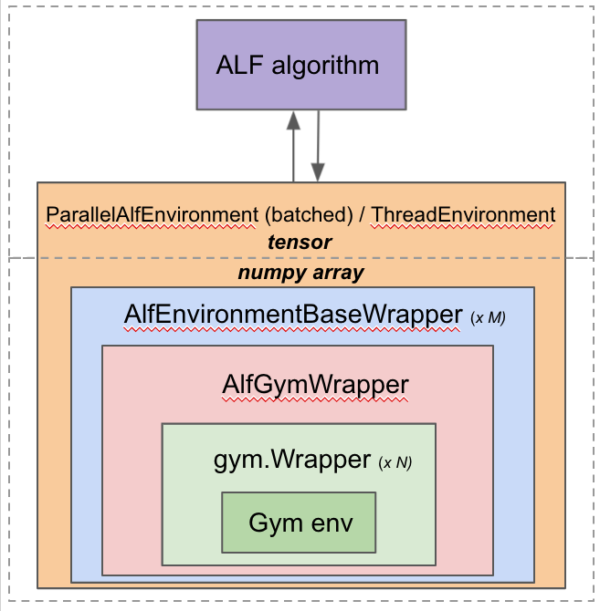

Environments and wrappers
=========================

In this chapter we'll walk through the environment wrapper hierarchy in
ALF. After reading you should be able to write customized environments and wrappers
for your own tasks.

Overview
--------

An overview of the hierarchy is illustrated above. Starting from the innermost
layer "Gym env", each layer is wrapped by the layer above, all the way up to the outermost
layer "ParallelAlfEnvironment" or "ThreadEnvironment" which is responsible for
interacting with ALF algorithms.

Generally, when the algorithm outputs an action to the environment, the action
flows from top to bottom, with each wrapper either simply passing or
transforming the action. When the environment returns a time step to the algorithm,
the time step flows from bottom to top in a reversed direction, with each wrapper
either simply passing or transforming the time step. When defining a new wrapper,
the user is supposed to define how to process the action and time step in the
wrapper's functions.

gym.Env and gym.Wrapper
-----------------------
The two innermost layers are standard `Gym <https://gym.openai.com/>`_ environment
and wrappers. ALF follows exactly the official definitions of Gym for these two
components. We recommend the user to first get familiar with these two concepts,
especially the Gym `wrappers <https://github.com/openai/gym/blob/master/docs/wrappers.md>`_.

ALF already defines a set of useful Gym wrappers, hosted at :mod:`.alf.environments.gym_wrappers`.
These wrappers include :class:`~.FrameStack` (stacking :math:`K` most recent observations),
:class:`~.FrameSkip` (repeating every action :math:`K` times),
and :class:`~.NormalizedAction` (normalizing a bounded continuous action to :math:`[-1,1]`),
etc. The user can stack a sequence of Gym wrappers.

Below we demonstrate how to write simple Gym wrappers. The first example is to
convert a dense reward task to a sparse reward one, assuming that we binarize
:math:`-/+` rewards to :math:`0/1` rewards.

.. code-block:: python

    class SparseReward(gym.Wrapper):
        """Binarize the original :math:`-/+` rewards to :math:`0/1`.
        """

        def __init__(self, env):
            gym.Wrapper.__init__(self, env)

        def step(self, action):
            ob, reward, done, info = self.env.step(action)
            reward = 1. if reward > 0 else 0.
            return ob, reward, done, info

The second example is to always clip the observation vector to a pre-defined range.

.. code-block:: python

    @alf.configurable
    class ObservationClipWrapper(gym.ObservationWrapper):
        """Clip observation values to a range.
        """

        def __init__(self, env, min_v=-200., max_v=200.):
            super().__init__(env)
            self._min_v = min_v
            self._max_v = max_v

        def observation(self, observation):
            return alf.nest.map_structure(
                lambda obs: np.clip(obs, self._min_v, self._max_v),
                observation)

Notice that in the above, we directly inherit the ``gym.ObservationWrapper`` which
is a special ``gym.Wrapper`` that only changes the returned observation. Also note
that we are able to decorate this wrapper by ``alf.configurable`` so that potentially
we could config the min/max values in a config file.

The last example is to avoid early termination of an episode by always returning
``done=False``.

.. code-block:: python

    class NonEpisodicEnv(gym.Wrapper):
        """Make a gym environment non-episodic by always setting ``done=False``."""

        def __init__(self, env):
            super().__init__(env)

        def step(self, action):
            ob, reward, done, info = self.env.step(action)
            return ob, reward, False, info

Generally, due to its simplicity, a Gym wrapper is the first option you should
consider when writing a wrapper. It allows you to process the I/O data with a logic
close to that of the underlying Gym environment. However, a downside of this wrapper
is that for the episode end signal, we can only return two possibilities: ``True``
and ``False``. There is **no** way to indicate whether the end is due to normal
finish or timeout (this distinction is critical and can be represented by
:class:`~.AlfGymWrapper` and :class:`~.AlfEnvironmentBaseWrapper`; see below).

.. note::

    We can customize the information contained in the returned ``info`` dict, and
    :class:`~.metrics.AverageEnvInfoMetric` (see :ref:`metrics <chap4_metrics>`)
    will automatically summarize it in the Tensorboard.

AlfGymWrapper
-------------

:class:`~.AlfGymWrapper` is a fixed wrapper class that's not supposed to be
inherited or modified by the user. Its main job is to convert the data structures
``(observation, reward, done, info)`` used by Gym for representing a time step
into :class:`~.TimeStep` used by ALF.

.. code-block:: python

    class TimeStep(
        namedtuple(
            'TimeStep', [
                'step_type', 'reward', 'discount', 'observation',
                'prev_action', 'env_id', 'untransformed', "env_info"
            ],
            default_value=())):

Fields of ``TimeStep``
^^^^^^^^^^^^^^^^^^^^^^

:class:`~.TimeStep` is a data structure that stores the information from the
result of each environment step. It contains eight fields:

* ``step_type``: type of this step. It has three possible values:

  1. :attr:`.StepType.FIRST` is the first step of an episode, which is typically
     the step generated from ``env.reset()``.
  2. :attr:`.StepType.LAST` is the last step of an episode.
  3. :attr:`.StepType.MID` is for all the other steps in an episode.

* ``reward``: reward from the previous action. In some RL literature, the
  reward for an action :math:`a_t` at time :math:`t` is usually written as
  :math:`r_t`. However, in ALF, :math:`r_t` will always represent the reward for
  the previous action at time :math:`t-1`.

* ``discount``: When calculating the cumulative discounted return, ``discount``
  is used to discount the future reward. There are some subtle details on how
  this value is set which we will describe later.

* ``observation``: observation from the environment. It can be a nest of
  Tensors. It is obtained after the environment execute a previous action.

* ``prev_action``: the previous action taken by the agent.

* ``env_id``: which environment this ``TimeStep`` comes from. This id
  information can be used by replay buffers and metrics if there are multiple
  environments accessing them asynchronously. *Only used by a batched environment.*

* ``untransformed``: a nest that represents the entire time step itself
  *before* any transformation (e.g., observation or reward transformation).

* ``env_info``: A dictionary containing information returned by Gym
  environments' ``info`` field.

In a word, :class:`~.AlfGymWrapper` processes and packs time step data from the
lower-level Gym wrappers, in preparation for ALF algorithms' use.

``step_type`` and ``discount``
^^^^^^^^^^^^^^^^^^^^^^^^^^^^^^

One responsibility of :class:`~.AlfGymWrapper` is to maintain the
time horizon information. For each time step, the wrapper uses a pair of values
``(step_type, discount)`` to indicate its temporal info, where ``step_type`` can
take a value from ``(FIRST, MID, LAST)`` and ``discount`` can be either :math:`0`
or :math:`1`. The following table summarizes the four valid combinations of the
two fields:

============== ======== ===================== ================ ===================================================
Step type      Discount | Value used          | Value          Note
                        | for bootstrapping   | to be learned?
                        | the previous value?
============== ======== ===================== ================ ===================================================
``FIRST``       1           No                  Yes            First step of an episode
``MID``         1           Yes                 Yes            Any step other than ``FIRST`` and ``LAST``
``LAST``        0           No                  No             Last step because of a normal game end
``LAST``        1           Yes                 No             Last step because of timeout
============== ======== ===================== ================ ===================================================

.. note::

    :class:`~.AlfGymWrapper` will automatically reset the episode if the step type
    is ``LAST``.

We can see that ``discount=0`` is only valid for step type ``LAST``. The reason why
we further divide ``LAST`` into two categories is due to two types of episode endings.
In an infinite-horizon setting, if an episode ends normally, ``discount`` is set
to :math:`0` to represent that the agent is at a sink state and no further reward
will be given. However, if an episode ends because of timeout, we want to use
:math:`1` instead of :math:`0` so that the value estimation at the last step can
be properly used to estimate the value of previous steps.

.. note::

    Here we assume that the time information is not provided in the observation
    so the agent is unaware of when the time limit will be reached. In this infinite
    horizon setting, the same (full) state/observation should have the same estimated
    value regardless of what time it is now (stationary) or whether it's going to be
    timeout. So we need to take special care of the discount value of a timeout episode end.
    Another rare setting is to inject time information (e.g., how many remaining steps)
    into the agent's observation, in which case we can always set ``discount=0``
    for an episode end, regardless of the reason.

So how do we activate the combination ``(step_type=LAST, discount=1)``? For this
purpose, we need to know whether the current time step reaches the time limit or not.

When a Gym environment is registered, there is an optional parameter named
``max_episode_steps`` which has default value of ``None``. For example, the following
is the registration for ``MountainCar`` environment:

.. code-block:: python

  register(
      id='MountainCar-v0',
      entry_point='gym.envs.classic_control:MountainCarEnv',
      max_episode_steps=200,
      reward_threshold=-110.0,
  )

Gym creates an ``EnvSpec`` object for each registered environment.
``EnvSpec`` has an attribute ``timestep_limit`` which returns the value
of ``max_episode_steps``.

A gym environment can be loaded by using ``gym.make()`` defined in
``gym.envs.registration``. If ``timestep_limit`` of the spec of this
environment is not ``None``, this function will wrap the environment using
``gym.wrappers.time_limit.TimeLimit``. This wrapper will end an episode by
returning ``done=True`` if the number of steps exceeds ``max_episode_steps``.
However, with ``done=True`` alone we won't be able to determine the cause of the
episode end.

To address this issue, we create an environment in the following way to avoid
``gym.wrappers.time_limit.TimeLimit``:

.. code-block:: python

  gym_spec = gym.spec(environment_name)
  gym_env = gym_spec.make()

Then we use ALF's own wrapper :class:`~.alf_wrappers.TimeLimit` (next section) to wrap
the environment to limit the steps so that it only sets ``step_type=LAST`` without
changing ``discount`` when ``max_episode_steps`` is reached.

.. code-block:: python

  if self._num_steps >= self._duration:
    if _is_numpy_array(time_step.step_type):
        time_step = time_step._replace(step_type=StepType.LAST)
    else:
        time_step = time_step._replace(
            step_type=torch.full_like(time_step.step_type, StepType.
                                      LAST))

.. note::

    There is no completely safe way to correctly set ``(step_type=LAST, discount=1)``
    because some Gym environments natively maintain the episode length and
    return ``done=True`` for timeout. So the ``gym_spec.make()`` trick above no
    longer works. Given a new Gym env, we should always make sure it does the right
    thing by reading its documentation or even source code!!

.. note::

    If the original Gym env does return ``done=True`` at ``N``-th step and you don't
    want to modify the source code, then another useful trick is to directly
    wrap ALF's :class:`~.alf_wrappers.TimeLimit` with ``duration=N-1``, to hijack
    the episode end.

.. _tensor_specs:

Tensor specs
^^^^^^^^^^^^

:class:`~.AlfGymWrapper` also defines several important :mod:`~.alf.tensor_specs`
to be used by ALF algorithms to construct networks.

.. code-block:: python

    def env_info_spec(self):
        return self._env_info_spec

    def time_step_spec(self):
        return self._time_step_spec

    def observation_spec(self):
        return self._observation_spec

    def action_spec(self):
        return self._action_spec

    def reward_spec(self):
        return self._reward_spec

These specs are all converted from Gym `spaces <https://github.com/openai/gym/tree/master/gym/spaces>`_.

AlfEnvironmentBaseWrapper
-------------------------

This wrapper class operates on top of the :class:`~.TimeStep` data structure. It
is the secondary wrapper class one should consider after ``gym.Wrapper`` if manipulation
on :class:`~.TimeStep` is needed. A good representative is the :class:`~.TimeLimit`
wrapper used in the previous section to modify the ``step_type`` when reaching a
time limit. ALF provides a useful set of such wrappers at :mod:`.alf.environments.alf_wrappers`.

Note that when an :class:`~.AlfEnvironmentBaseWrapper` changes I/O formats, you
need also to make sure to update the corresponding tensor specs listed :ref:`above <tensor_specs>`.

Like ``gym.Wrapper``, we can also stack a sequence of :class:`~.AlfEnvironmentBaseWrapper`.

:class:`.ParallelAlfEnvironment` and :class:`.ThreadEnvironment`
----------------------------------------------------------------

The outermost layer is :class:`~.ParallelAlfEnvironment` which batches several
parallel :class:`~.AlfEnvironment` together to obtain a *batched* environemnt.
Each individual env in the batch is created in a separate sub-process.
:class:`~.ParallelAlfEnvironment` is responsible to pack all time steps returned
from individual envs, and output it to an ALF algorithm. When the algorithm returns
a batch of action data, this class distributes individual actions to the corresponding
envs.

:class:`~.ParallelAlfEnvironment` also converts between Pytorch tensors and Numpy arrays,
as shown in the overview figure.

:class:`~.ThreadEnvironment` is a special case where only one environment is
created (``batch_size=1``) and it's created in the main process by a thread. This
class is usually used for evaluation or play.

Sometimes a Gym environment will
crash or behave abnormally if it's wrapped by a ``ThreadEnvironment``.
So ``ParallelAlfEnvironment`` is usually preferred for single or multiple
training environments.

However, gin/alf configurations that are used by subprocesses will not be considered
by the main process as "operative". So to help debug, sometimes a ``ThreadEnvironment``
is additionally created because it uses gin/alf configurations in the main process.
If an evaluation environment is needed, this thread environment can also serve
as the evaluation environment.

To resolve the conflict of two, ``TrainerConfig`` provide a flag ``no_thread_env_for_conf``.
The logic of creating an evaluation environment or a thread env is illustrated
below:

================================ ================================================================ =============================================
``TrainerConfig`` flags          ``evaluate=True``                                                ``evaluate=False``
================================ ================================================================ =============================================
``no_thread_env_for_conf=True``  ``eval_env`` :math:`\leftarrow` ``ParallelAlfEnvironment`` (N=1) ``None``
``no_thread_env_for_conf=False`` ``eval_env`` :math:`\leftarrow` ``ThreadEnvironment``            | Is training env ``ParallelAlfEnvironment``?
                                                                                                  | Yes: ``ThreadEnvironment``
                                                                                                  | No: ``None``
================================ ================================================================ =============================================

.. note::

    ALF makes sure that every individual env in a batch receives a different random
    seed to produce diverse environment data. Additionally, given the same global
    seed twice, ALF guarantees that individual envs receive the same set of different
    seeds in the same order.

How the wrappers are put together
---------------------------------

The ``load()`` function from various environment suites such as
:func:`.alf.environments.suite_gym.load` or :func:`.alf.environments.suite_robotics.load`
stacks all wrappers together up to the level of :class:`.ParallelAlfEnvironment`
and :class:`.ThreadEnvironment`. For example,

.. code-block:: python

    for wrapper in gym_env_wrappers:
        gym_env = wrapper(gym_env)

    ...

    env = alf_gym_wrapper.AlfGymWrapper(
        gym_env=gym_env,
        env_id=env_id,
        discount=discount,
        auto_reset=auto_reset,
    )

    ...

    if max_episode_steps > 0:
        env = time_limit_wrapper(env, max_episode_steps)
    for wrapper in alf_env_wrappers:
        env = wrapper(env)

Finally, :func:`.alf.environments.utils.create_environment` creates :class:`.ParallelAlfEnvironment`
or :class:`.ThreadEnvironment` using the ``load()`` function.

Directly define a batched environment
-------------------------------------

Sometimes it might be more convenient to directly define a batched environment with
tensor data, so that all the wrapper layers below :class:`.ParallelAlfEnvironment`
and :class:`.ThreadEnvironment` are discarded. In order for :func:`~.alf.environments.utils.create_environment`
to correctly a batched environment without replying on :class:`.ParallelAlfEnvironment`,
the corresponding ``load()`` should have ``load.batched=True``. See :mod:`~.alf.environments.suite_carla`
for a good example.

Summary
-------

In this chapter we've covered various aspects of ALF environments and wrappers,
and also introduced some important concepts such as :class:`~.TimeStep`. To sum up,
if wrappers related to Gym task specification are needed, then ``gym.Wrapper`` is
usually a good choice; if changes on :class:`~.TimeStep` are needed, then
:class:`~.AlfEnvironmentBaseWrapper` is required. Finally, we should remember
when writing a new environment or wrapper, it's always important to check if timeout
has been correctly handled or not.