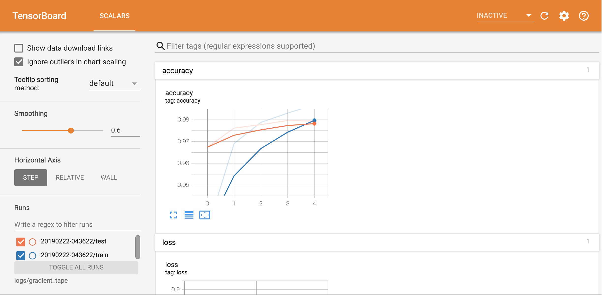

Summary, metrics, and Tensorboard
=================================

ALF uses `Tensorboard <https://www.tensorflow.org/tensorboard>`_ to track and
visualize training statistics.

Tensorboard background
----------------------

In a nutshell, we summarize a scalar, a histogram,
an image, etc by calling Tensorboard's API functions that also take a *global
step counter* as the input. The global steps serve as x-axis ticks to align
different metrics. A global counter can usually be defined as the training iteration
number or gradient update number. One example of using the TB's official APIs is

.. code-block:: python

    # create file writers to record the training and testing accuracies respectively
    train_summary_writer = tf.summary.create_file_writer("/tmp/log_dir/train")
    test_summary_writer = tf.summary.create_file_writer("/tmp/log_dir/test")
    for epoch in range(EPOCHS):
        # ... code for computing the training loss and training accurarcy
        with train_summary_writer.as_default():
            tf.summary.scalar('accuracy', training_accuracy, step=epoch)
        # ... code for computing the testing accuracy
        with test_summary_writer.as_default():
            tf.summary.scalar('accuracy', test_accuracy, step=epoch)
        # by providing the same scalar name, TB will show the two accuracy curves
        # in the same figure.

And by opening the TB page

.. code-block:: bash

    tensorboard --logdir /tmp/log_dir

We'll see something like

We strongly suggest that the user first read Tensorboard's
`official guide <https://www.tensorflow.org/tensorboard/get_started>`_ to get
familiar with TB basics.

ALF summary
-----------

ALF wraps ``tf.summary`` as ``alf.summary`` (:mod:`alf.summary.summary_ops`) to
provide additional useful functionalities, including

1. global counter management,
2. turning on/off of the summary according to conditions,
3. name scope support.

ALF also provides a set of helper summary functions in the context of deep RL (:mod:`alf.utils.summary_utils`).

Global counter
^^^^^^^^^^^^^^

ALF automatically maintains a global counter as the current training iteration
number. Recall that the total number of iterations can be set by :attr:`~.TrainerConfig.num_iterations`,
or it will be automatically calculated if :attr:`~.TrainerConfig.num_env_steps` is
provided. So the x-axes of most TB figures should represent training iterations.

In some off-policy cases, we have several gradient updates for each iteration,
for example, PPO. And sometimes we'd like to summarize metrics based on the gradient
update number. Thus we can set the global counter as the gradient update number instead,
by setting ``TrainerConfig.update_counter_every_mini_batch=True``. This will make
the x-axis display the number of mini-batch updates.

.. note::

    The relationship between total number of iterations and total number of updates
    is captured by

    .. code-block:: python

        updates = TrainerConfig.num_updates_per_train_iter * TrainerConfig.num_iterations

    In some rare case of replaying a whole buffer but each gradient update only
    uses a portion of the whole buffer, then an additional factor ``whole_buffer_size / batch_size``
    should be multiplied. (For example, we can specify :attr:`~.TrainerConfig.mini_batch_length`
    and :attr:`~.TrainerConfig.mini_batch_size` for PPO even though the entire
    replay buffer is replayed at every iteration.)

Since the global counter is implicitly maintained by ALF, we usually don't need
to specify a step when using ``alf.summary``.

    .. code-block::

        alf.summary.scalar("accuracy", training_accuracy)

ALF will write all summarized metrics before the next increment (next iteration
or next mini-batch) of the global counter to the same step.

.. note::

    If you write metrics to the *same* tag/label multiple times within one step,
    the behavior is undefined. Usually you'll see multiple y values at a single
    x tick.

Turning on/off summary
^^^^^^^^^^^^^^^^^^^^^^

At any point of the code, you can enable or disable the summary by

    .. code-block:: python

        alf.summary.enable(True)
        alf.summary.enable(False)

This forces to turn on or off all summary code globally.

If you'd like to enable or disable based on a certain condition, then use the
:class:`~.summary_ops.record_if` context manager:

    .. code-block:: python

        for i in in range(100):
            # record only on odd value of i
            with alf.summary.record_if(lambda: i % 2):
                alf.summary.scalar("i", float(i))
                # increment the counter otherwise all scalars are written to the same x!
                alf.summary.increment_global_counter()

Note that ALF maintains a *stack* of ``record_if`` conditions. So if you start
a ``record_if`` context, then it always overwrites existing conditions. For example,

    .. code-block:: python

        for i in range(100):
            with alf.summary.record_if(lambda: i % 2):
                with alf.summary.record_if(lambda: i % 3 == 1):
                    # recorded every one out of three `i`s
                    alf.summary.scalar("i_3", float(i))
                # recorded every one out of two `i`s
                alf.summary.scalar("i_2", float(i))
            # there will be no data points for even values of i where i % 3 != 1
            alf.summary.increment_global_counter()

By default, ALF's trainer places a ``record_if`` condition at the bottom of the stack.
This condition is defined by :attr:`TrainerConfig.summary_interval`. It's evaluated
to be ``True`` if

1. the global step is less than ``summary_interval``, or
2. the global step is a multiple of ``summary_interval``.

The reason why we have the first condition is that sometimes we want to inspect
closely on the training metrics step by step when the training just starts, which
is helpful for debugging. Because of the second condition, we will normally only
see metric values every ``summary_interval`` steps in TB.

Like other ``record_if`` conditions, this summary interval condition can be overwritten
by another condition on top of the stack:

    .. code-block:: python

        with alf.summary_record_if(lambda: True):
            # always summarize the code in this context at every step
            alf.summary.scalar(...)

.. note::

    ``record_if`` stack is only activated when ``alf.summary.enable(True)`` has
    been called. You can use the function :func:`.alf.summary.is_summary_enabled`
    to check whether the summary is enabled or not.

Summary name scope
^^^^^^^^^^^^^^^^^^

ALF also maintains a *name scope stack* for conveniently managing summary metric
names. This stack greatly simplifies naming metrics.

.. code-block:: python

    with alf.summary.scope("root"):
        alf.summary.scalar("val", 1)     # TB tag is "root/val"
        with alf.summary.scope("train"):
            alf.summary.scalar("val", 1) # TB tag is "root/train/val"

It's recommended that you use class or function names as summary scopes so that
it's easy to locate where the metrics are summarized and what they are for.

Summary utils functions for RL
^^^^^^^^^^^^^^^^^^^^^^^^^^^^^^

ALF provides various helper functions for summarizing quantities in the context of
deep RL, for example, :func:`~.alf.utils.summary_utils.summarize_action`,
:func:`~.alf.utils.summary_utils.summarize_action_dist`,
:func:`~.alf.utils.summary_utils.summarize_gradients`, etc. See
:mod:`.alf.utils.summary_utils` for a complete list.

.. _chap4_metrics:

Important metrics for RL
------------------------

By default, ALF summarizes several important RL metrics during training and evaluation.
All these metrics (defined in :mod:`.alf.metrics.metrics`) are summarized on the
*episode basis*.

1. :class:`~.metrics.NumberOfEpisodes`: how many episodes have been trained so far.
2. :class:`~.metrics.EnvironmentSteps`: how many environment steps have been
   trained so far.
3. :class:`~.metrics.AverageReturnMetric`: the return of an episode, averaged over
   several most recent episodes.
4. :class:`~.metrics.AverageEpisodeLengthMetric`: the length of an episode, averaged
   over several most recent episodes.
5. :class:`~.metrics.AverageEnvInfoMetric`: the accumulation of any quantity returned
   by Gym env info during an episode, averaged over several most recent episodes.
6. :class:`~.metrics.AverageDiscountedReturnMetric`: the discounted return of an
   episode, averaged over several most recent episodes.

.. note::

    For metrics 3-6, you can configure ``buffer_size`` of the classes to decide how
    many recent episodes to use.

These important RL metrics are summarized against several types of step counters:

1. the global step counter as introduced earlier,
2. the total number of environment steps so far, and
3. the total number of episodes so far.

You will see the tabs "Metrics", "Metrics_vs_EnvironmentSteps", and "Metrics_vs_NumberOfEpisodes"
respectively in the TB.

Defining new episode metrics
^^^^^^^^^^^^^^^^^^^^^^^^^^^^

For step-wise summary, we can directly use the summary functions in :mod:`.alf.summary.summary_ops`.
To define new episode metrics, please take a look at :mod:`.alf.metrics.metrics`
on how to use :class:`.AverageEpisodicSumMetric` for this purpose.

After defining the new episode metric, you'll need to override the ``__init__()``
of :class:`.RLAlgorithm` to insert this new metric. The existing ones are currently
hard-coded as below:

.. code-block:: python

    self._metrics = [
       alf.metrics.NumberOfEpisodes(),
       alf.metrics.EnvironmentSteps(),
       alf.metrics.AverageReturnMetric(
           batch_size=env.batch_size,
           buffer_size=metric_buf_size,
           reward_shape=reward_spec.shape),
       alf.metrics.AverageEpisodeLengthMetric(
           batch_size=env.batch_size, buffer_size=metric_buf_size),
       alf.metrics.AverageEnvInfoMetric(
           example_env_info=env.reset().env_info,
           batch_size=env.batch_size,
           buffer_size=metric_buf_size),
       alf.metrics.AverageDiscountedReturnMetric(
           batch_size=env.batch_size,
           buffer_size=metric_buf_size,
           reward_shape=reward_spec.shape)]

Summary
-------
In this chapter, we've covered how to write summary code in ALF. To efficiently
debug and monitor RL training jobs, various summary metrics are always important
clues. It is a good practice to add customized summary code when you write your
own algorithm.