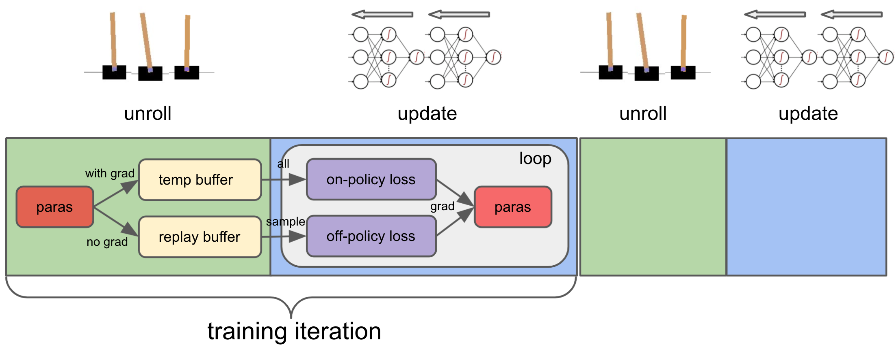

Understanding ALF via the minimal working example
=================================================

In the previous chapter :doc:`./a_minimal_working_example`, we talked about how
to train a minimal conf file and play the trained model. The 8-line code in it
is just the tip of the iceberg: a very sophisticated RL training pipeline runs
under the surface. In this chapter, based on that minimal example, we will
go through some major concepts of ALF and grasp the big picture.

ALF overview
------------

As a good analogy, you can think of ALF as a very flexible
*circuit board*. A circuit board electrically connects electronic components using
conductive tracks, and the various components on the board altogether fulfill some
kind of complex function. Similarly, ALF is a framework that logically connects
algorithmic components and fulfills RL training tasks.

However, different with a circuit board, ALF's components are highly customizable. In the
figure above, the temperature color (redness) represents how frequently each
component is expected to be modified by a user in typical ALF use cases.

.. note::
    For examples:

    1. If training an existing algorithm (e.g., SAC) on existing environments/tasks
       (e.g., ``Hopper-v3``), only "data transformer" and "models&networks" are to
       be modified.
    2. If a new algorithm is tried on existing environments/tasks,
       "algorithm hierarchy" is additionally to be modified.
    3. In a rare case, "trainer" needs to be modified if the desired pipeline is
       vastly different from what ALF has by default.

Importantly, whatever component is changed, ALF's design makes sure that the
pipeline still runs with the other components unchanged.

And the customization is very easy to implement. The user only needs to write a
*configuration* file in Python to specify which components need what changes. As a
typical Python file, this conf file also supports writing new code for any ALF
component (e.g., defining new algorithms :doc:`./customize_algorithms`,
models, environments :doc:`./environments_and_wrappers`, etc).

.. _chap2_big_picture:

The big picture
---------------

Once a conf file is provided to the ALF trainer, the training pipeline runs according
to the configuration. We will take the `"CartPole" <https://gym.openai.com/envs/CartPole-v0/>`_
task as an example for a better explanation. The goal is to move left or right
to keep the balance of the vertical pole on a cart so that the pole doesn't fall down.

.. image:: images/cart_pole.png
    :width: 200
    :align: center
    :alt: CartPole-v0

One can naturally imagine that an RL system collects experience data by trying
out different actions and observing the consequences, while optimizing its model
parameters in parallel, as shown below:

In fact, ALF adopts a simplified setting. The training pipeline alternates
between "unroll" (online data collection) and "update"
(parameters updates). In general, there are
two types of pipelines: on-policy and off-policy, corresponding to on-policy
algorithms (e.g., :class:`.ActorCriticAlgorithm`) and off-policy algorithms
(e.g., :class:`.SacAlgorithm`).

1. "unroll": in this process, a behavior policy generates a batch of actions, each
   output to one of the parallel environments, to collect a batch of experience
   data per time step. The policy rolls out multiple time steps for data collection
   before transitioning to "update". For on-policy algorithms, an inference
   computational graph with grads will be preserved and passed to "update". For
   off-policy algorithms, no computational graph is preserved and the data directly
   go to a replay buffer.
2. "update": a loop of parameter updates are performed. On-policy algorithms compute
   losses on all samples in the temp buffer while off-policy algorithms compute losses
   on mini-batch samples from a replay buffer. *The loop length is forced to be 1
   for on-policy algorithms.*

.. note::
    The concept of "episode" is orthogonal to the pipeline. A training iteration
    might divide an episode into multiple segments. In order words, parameter
    update could happen before a complete episode finishes.

A conf file usually

1. chooses which pipeline to use through the root algorithm configured to :class:`.TrainerConfig`;
2. tweaks the schedule of a pipeline by changing the "unroll" interval (:attr:`.TrainerConfig.unroll_length`),
   the "update" loop (:attr:`.TrainerConfig.num_updates_per_train_iter`), the mini-batch
   shape (:attr:`.TrainerConfig.mini_batch_size` x :attr:`.TrainerConfig.mini_batch_length`), etc;
3. how on-policy/off-policy losses are computed, for example, which algorithms
   using what networks computing what losses.

Although very rare, a user can customize a new training pipeline. We will talk about
this in :doc:`./customize_training_pipeline`.

More than training pipelines
----------------------------

Another major effort of ALF is providing an extensive set of high-quality tools
for RL research, including various algorithms, networks, layers, and environments.

.. code-block:: bash

    alf/algorithms/
    alf/networks/
    alf/layers.py
    alf/environments/

A user can easily experiment them via the conf file.

What the minimal example does
-----------------------------

Let's go back to our first example which trains an existing algorithm
:class:`.ActorCriticAlgorithm` on ``CartPole-v0``. To achieve this, normally we would
need to configure the environment name by

.. code-block:: python

    alf.config("create_environment",
               env_name="CartPole-v0",
               num_parallel_environments=30)

which tells ALF to use ``CartPole-v0`` and create 30 environments in parallel for
rollout data collection. The :func:`.create_environment` function is defined as:

.. code-block:: python

    @alf.configurable
    def create_environment(env_name='CartPole-v0',
                           env_load_fn=suite_gym.load,
                           num_parallel_environments=30,
                           nonparallel=False,
                           seed=None,
                           batched_wrappers=())

We can see that because the default values of ``env_name`` and ``num_parallel_environments``
are already what we want, in the example conf we've skipped configuring them. But
it is recommended to always explicitly specify them in a conf for readability
purpose. On the other hand, ``env_load_fn`` is the func that loads ``env_name``.
Usually :func:`.suite_gym.load` can load most built-in Gym environments. For
extra Gym environments or user-customized environments, this argument value
should be set accordingly. For instance, see :func:`.suite_mario.load` and
:func:`.suite_simple.load`.

.. note::
    **ALF configuration** is one of the secret sauces that make ALF flexible.

    For any function decorated by :func:`~alf.config_util.configurable`, we can
    configure its argument value **before** that function is actually evaluated.
    If configured, the default value will be overwritten by the configured value.
    :func:`~.alf.config_util.config` can be called multiple times on the same
    function.

.. note::
    When ``nonparallel=False``, ALF always creates a **batched environment**. This
    env accepts batched actions and returns batched observations/rewards/info.
    The first dim of these tensors is the batch size equal to ``num_parallel_environments``.

The example conf file configures the algorithm, number of training iterations,
and the optimizer by

.. code-block:: python

    alf.config('TrainerConfig',
               algorithm_ctor=partial(
                    ActorCriticAlgorithm, optimizer=alf.optimizers.Adam(lr=1e-3)),
               num_iterations=1)

The algorithm and training iterations are configured through a global object
:class:`.TrainerConfig`, which is supposed to be passed from the trainer to algorithms.
One important hyperparameter that's skipped in the conf file is ``unroll_length``.
We simply use its default value which is equivalent to doing

.. code-block:: python

    alf.config("TrainerConfig", unroll_length=8)

This specifies how many rollout steps are performed in *each* environment before
updating parameters (in total :math:`30\times 8=240` steps). In this very simple
example, after 30 environments unroll 8 steps, the trainer updates the model
parameters once and the training finishes.

The algorithm itself is configurable, too. Because ALF allows defining a hierarchy
of algorithms (e.g., an RL algorithm with an auxiliary self-supervised learning
child algorithm), and each algorithm can have a different optimizer, the optimizer
configuration is always through the algorithm interface. Here we use Adam with a
learning rate of :math:`10^{-3}`.

.. note::
    :class:`.TrainerConfig` is a very important concept in ALF. It allows customizing
    many crucial parameters of the training pipeline, for example, random seed, number
    of checkpoints, summary interval, rollout length, etc. The user is highly
    recommended to read the API doc of this class.

Everything can be configured!
-----------------------------

If you look at the algorithm class definition,

.. code-block:: python

    @alf.configurable
    class ActorCriticAlgorithm(OnPolicyAlgorithm):
        """Actor critic algorithm."""

        def __init__(self,
                     observation_spec,
                     action_spec,
                     reward_spec=TensorSpec(()),
                     actor_network_ctor=ActorDistributionNetwork,
                     value_network_ctor=ValueNetwork,
                     epsilon_greedy=None,
                     env=None,
                     config: TrainerConfig = None,
                     loss=None,
                     loss_class=ActorCriticLoss,
                     optimizer=None,
                     debug_summaries=False,
                     name="ActorCriticAlgorithm")

its arguments are also configurable. Notably, ``actor_network_ctor`` and
``value_network_ctor`` allow configuring the actor and value networks, respectively.
By default :class:`.ActorDistributionNetwork` is used. This class can potentially be
replaced by a user's custom actor network class. By further looking into

.. code-block:: python

    @alf.configurable
    class ActorDistributionNetwork(Network):
        """Network which outputs temporally uncorrelated action distributions."""

        def __init__(self,
                     input_tensor_spec,
                     action_spec,
                     input_preprocessors=None,
                     preprocessing_combiner=None,
                     conv_layer_params=None,
                     fc_layer_params=None,
                     activation=torch.relu_,
                     kernel_initializer=None,
                     use_fc_bn=False,
                     discrete_projection_net_ctor=CategoricalProjectionNetwork,
                     continuous_projection_net_ctor=NormalProjectionNetwork,
                     name="ActorDistributionNetwork"):

you'll realize that the actor network is also configurable, including its layers,
input preprocessors, kernel initializer, and projection network, etc. If we keep
going deeper, the projection network can also be configured (assuming we have
continuous actions):

.. code-block:: python

    @alf.configurable
    class NormalProjectionNetwork(Network):
        def __init__(self,
                     input_size,
                     action_spec,
                     activation=math_ops.identity,
                     projection_output_init_gain=0.3,
                     std_bias_initializer_value=0.0,
                     squash_mean=True,
                     state_dependent_std=False,
                     std_transform=nn.functional.softplus,
                     scale_distribution=False,
                     dist_squashing_transform=dist_utils.StableTanh(),
                     name="NormalProjectionNetwork"):

In the above example conf, we didn't bother configuring all these one by one. The
default argument values were used.

``alf.config`` vs. ``partial``
^^^^^^^^^^^^^^^^^^^^^^^^^^^^^^

One good thing about ALF configuration is that you can easily configure something
that is deep in the calling tree by one line, e.g.,

.. code-block:: python

    alf.config("alf.networks.projection_networks.NormalProjectionNetwork",
               activation=torch.tanh)

.. note::
    In fact, you can also specify a shorter name for the class/function to be
    configured, as long as the specified name is an unambiguous suffix of a
    complete path under ALF. For example,
    ``alf.config("NormalProjectionNetwork", activation=torch.tanh)`` will also
    work.

Compared to passing a huge config dictionary from the main function to other places
in the code, this makes the code less cluttered. However, one side effect is that
the configuration takes place *globally*. That is, if there are multiple places
that create :class:`.NormalProjectionNetwork`, they will share the same configured
values.

There are two ways of overwriting the globally configured values. One is to
manually overwrite argument values where the configured values are not
needed, e.g.,

.. code-block:: python

    # the hard-coded ``torch.relu`` will shadow the configured ``torch.tanh``
    proj_net = NormalProjectionNetwork(activation=torch.relu, ...)

In this case, the configuration ``activation=torch.tanh`` becomes *inoperative*.

.. note::
    **Inoperative vs operative**

    There are two types of configured values. An *operative* config value is one
    that is eventually used when calling a class or function. This includes those
    default config values (not necessarily provided by a user's conf file).
    In contrast, an *inoperative* config value is one that is overwritten by another
    value, e.g., by a hard-coded value in the code.

    This distinction between the two config types is useful for debugging,
    because it helps avoid the case where a user thinks a provided config should
    take effect but in fact it's shadowed. You can find this information in
    "TEXT/config" tab in the Tensorboard. For details, see the next chapter
    :doc:`./summary_metrics_and_tensorboard`.

The other way is to use `partial <https://docs.python.org/3/library/functools.html#functools.partial>`_
which is a Python built-in helper function from the ``functools`` package.

::

    The partial() is used for partial function application which ``freezes''
    some portion of a function’s arguments and/or keywords resulting in a new
    object with a simplified signature.

In a word, ``partial`` creates a `closure <https://en.wikipedia.org/wiki/Closure_(computer_programming)>`_
(local named scope) that partially binds some arguments with the provided values.
So to achieve the same purpose, alternatively we could do

.. code-block:: python

    alf.config('ActorDistributionNetwork',
               continuous_projection_net_ctor=partial(
                    NormalProjectionNetwork,
                    activation=torch.tanh))

This avoids globally changing the activation function of :class:`.NormalProjectionNetwork`.
Moreover, to avoid globally changing anything about the algorithm, the entire
calling path can use ``partial`` in a nested way:

.. code-block:: python

    alf.config('TrainerConfig',
               algorithm_ctor=partial(
                 ActorCriticAlgorithm,
                 optimizer=alf.optimizers.Adam(lr=1e-3),
                 actor_network_ctor=partial(
                    ActorDistributionNetwork,
                    continuous_projection_net_ctor=partial(
                        NormalProjectionNetwork,
                        activation=torch.tanh))))

Of course, with ``partial``, you can also assign a partially evaluated class/function
to a variable and pass this closure around (e.g., to other conf files).

.. code-block:: python

    algorithm_ctor = partial(ActorCriticAlgorithm, optimizer=alf.optimizers.Adam(lr=1e-3))
    alf.config('TrainerConfig', algorithm_ctor=algorithm_ctor)

.. note::
    We always recommend the user to use ``partial`` whenever possible in order to
    avoid global side effects. However, if you are sure that only one object instance
    is going to be created or no harmful side effect will take place (e.g.,
    :class:`.TrainerConfig`, and :func:`.create_environment`), then
    :func:`~alf.config_util.config` will be more convenient.

ALF is flexible
---------------

Now we try another arbitrary environment which has continuous actions.
To do so, we just append

.. code-block:: python

  alf.config("create_environment", env_name="LunarLanderContinuous-v2")

to the example conf file, to replace the default ``CartPole-v0`` environment
with ``LunarLanderContinuous-v2``.  The conf file can still be trained successfully.
In this training, the :class:`.ActorCriticAlgorithm` algorithm is again used, but on
continuous actions. It turns out that ALF can automatically adapt to different
action types without the user telling it what to do!

As another example, we replace the algorithm with PPO by appending:

.. code-block:: python

  from alf.algorithms.ppo_algorithm import PPOAlgorithm
  alf.config("TrainerConfig",
             algorithm_ctor=partial(
                PPOAlgorithm, optimizer=alf.optimizers.Adam(lr=1e-3)))

The conf file still works without any problem.

ALF's flexibility is more than this. In fact, ALF can adapt to different observations
(e.g., image vs. vector), rewards (e.g., scalar vs. vector), and actions (e.g.,
discrete vs. continuous). The reason is that ALF hard-codes very few things, and
it always assumes the most general scenario when handling observations, rewards,
and actions. The secret weapon for supporting this flexibility is :class:`.TensorSpec`.
A :class:`.TensorSpec` allows an API to describe the tensors that it accepts or returns,
before those tensors exist. This allows dynamic and flexible graph construction and
configuration.

In summary, different components on a ALF pipeline are connected by using
:class:`.TensorSpec` to specify their I/O specs. This also happens within a component,
for example, between child algorithms, between networks, etc.

Summary
-------

In this chapter we've talked about ALF configuration and pipeline based on the
minimal example. We've shown that ALF is essentially a pipeline that connects
different components which can be customized by a conf file. Moreover, ALF
provides various arms for doing RL research.

It might still be unclear to a user what roles an algorithm plays in the training
pipelines. In the next chapter :doc:`./algorithm_interfaces`, we will explain
the most important common algorithm interfaces to fill in the gap.
